.. _proj2_results_transport:

Jupyter Notebook for Transport Correction Factors
=================================================

Questions 4 - 6
---------------

Question 4 - Transport Correction Factors
~~~~~~~~~~~~~~~~~~~~~~~~~~~~~~~~~~~~~~~~~

Solve for the transport correction factors in H-1 using a typical
fission spectrum and a point source at 19 MeV

First do some imports

.. code:: ipython3

    # Imports
    import matplotlib.pyplot as plt
    import numpy as np

    import numpy as np
    import pandas as pd
    import time

    from transportcorrection import energyInterpolation, Plot1d
    from transportcorrection import infFluxSolver, TRCSolver, plot_matrix, solveFluxAndTRC

    # Plot settings
    plt.rcParams['font.size'] = 12
    plt.rcParams['figure.figsize'] = [5, 3] # Set default figure size

Setup the source and then pass all the data into solveFluxAndTRC()

This function first solves for the flux, then it passes the flux into
another function to solve for the Transport correction ratio

2x plots are generated - the first is the matrix used to solve for the
flux - we can analyze how dense it is and its shape.

For H-1, scattering is possible for all energies above E - the matrix
should therefore be fully upper triangular.

However, for H-2, scattering will depend on the value of :math:`\alpha`:

$ :raw-latex:`\alpha `E' < E < E'$

.. code:: ipython3

    # Watt fission spectrum source
    dataFile = "./database/H1.csv"

    data = pd.read_csv(dataFile)
    energy = np.array(data['energy'])
    src = np.exp(-energy/9.880E+05)*np.sinh((2.249E-06*energy)**0.5)
    src = src / src.sum()

    # Now solve using the below settings:
    energy1,tau_CHI,tau0,flx = solveFluxAndTRC(dataPath=dataFile,
                    isotopeMass=1.0,
                    energyN=3000,
                    lowerE=1,
                    upperE=19e6,
                    src=src,
                    rule='trap',
                    plotFluxMatrix=True,
                    plotTaus=True)

.. parsed-literal::

    Time to solve for flux is 0.3350539207458496
    Flux calculation took 0.3354883 s
    Tau calculation took 0.2996173 s
    Total time is 0.6351154 s

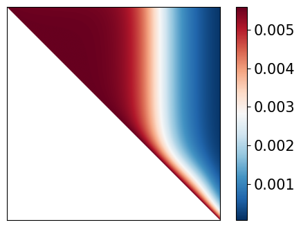

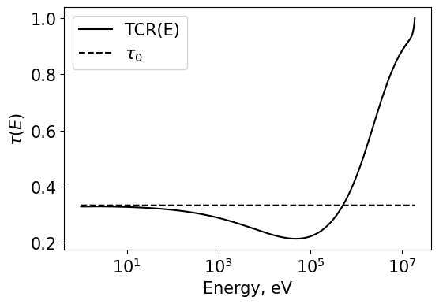

.. code:: ipython3

    # Point source
    dataFile = "./database/H1.csv"

    data = pd.read_csv(dataFile)
    energy = np.array(data['energy'])
    src = np.exp(-energy/9.880E+05)*np.sinh((2.249E-06*energy)**0.5)
    src *= 0.0
    src[-1] = 1.0
    src = src / src.sum()

    # Now solve using the below settings:
    energy1,tau_POINT,tau0,flx = solveFluxAndTRC(dataPath=dataFile,
                    isotopeMass=1.0,
                    energyN=3000,
                    lowerE=1,
                    upperE=19e6,
                    src=src,
                    rule='trap',
                    plotFluxMatrix=True,
                    plotTaus=True)

.. parsed-literal::

    Time to solve for flux is 0.48505210876464844
    Flux calculation took 0.4855015 s
    Tau calculation took 0.4006200 s
    Total time is 0.8861315 s

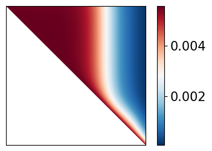

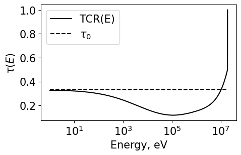

.. code:: ipython3

    # Plot both
    Plot1d(energy1, tau_CHI, xlabel="Energy, eV", ylabel="$\\tau(E)$", fontsize=13, marker="k-", markerfill=False, markersize=3, legend='TCR(E) (fission spectrum)')
    Plot1d(energy1, tau_POINT, xlabel="Energy, eV", ylabel="$\\tau(E)$", fontsize=13, marker="b-", markerfill=False, markersize=3, legend='TCR(E) (19 MeV source)')
    Plot1d(energy1, tau0, xlabel="Energy, eV", ylabel="$\\tau(E)$", fontsize=13, marker="--r", markerfill=False, markersize=3, legend='1/3')
    plt.grid()
    plt.savefig('results/tcr_H1_q4.png', bbox_inches='tight')

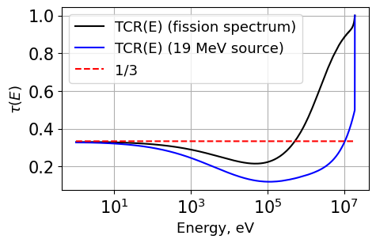

Question 5 - H2 implementation
~~~~~~~~~~~~~~~~~~~~~~~~~~~~~~

Now we do the same as above but for H-2. Note the matrix is now much
different. The TCR is also plotted.

.. code:: ipython3

    # Watt fission spectrum source
    dataFile = "./database/H2.csv"
    data = pd.read_csv(dataFile)
    energy = np.array(data['energy'])
    src = np.exp(-energy/9.880E+05)*np.sinh((2.249E-06*energy)**0.5)
    src = src / src.sum()

    # Now solve using the below settings:
    energy1,tau_CHI,tau0,flx = solveFluxAndTRC(dataPath=dataFile,
                    isotopeMass=2.0,
                    energyN=3000,
                    lowerE=1,
                    upperE=19e6,
                    src=src,
                    rule='trap',
                    plotFluxMatrix=True,
                    plotTaus=True)
    plt.grid()
    plt.savefig('./results/H2_q5.png', bbox_inches='tight')

.. parsed-literal::

    Time to solve for flux is 0.2839996814727783
    Flux calculation took 0.2844796 s
    Tau calculation took 0.3277695 s
    Total time is 0.6122637 s

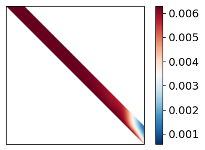

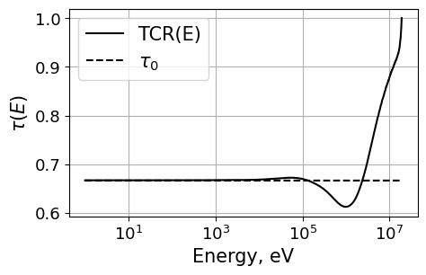

The cross sections are now plotted:
^^^^^^^^^^^^^^^^^^^^^^^^^^^^^^^^^^^

.. code:: ipython3

    # Get xs for plotting
    dataFile = "./database/H2.csv"
    data = pd.read_csv(dataFile)
    energy = np.array(data['energy'])
    scattering = np.array(data['scattering'])
    total = np.array(data['total'])
    #  Plot

    Plot1d(energy, total, xlabel="Energy, eV", ylabel="$\Sigma(E)$", fontsize=15, marker="k-", markerfill=False, markersize=3, legend="$\Sigma_t(E)$")
    Plot1d(energy, scattering, xlabel="Energy, eV", ylabel="$\Sigma(E)$", fontsize=15, marker="r--", markerfill=False, markersize=3, legend="$\Sigma_s(E)$")
    Plot1d(energy, total-scattering, xlabel="Energy, eV", ylabel="$\Sigma(E)$", fontsize=15, marker="k--", markerfill=False, markersize=3, legend="$\Sigma_a(E)$")
    plt.grid()
    plt.savefig('./results/XS_q5.png', bbox_inches='tight')

.. parsed-literal::

    <>:9: SyntaxWarning: invalid escape sequence '\S'
    <>:9: SyntaxWarning: invalid escape sequence '\S'
    <>:10: SyntaxWarning: invalid escape sequence '\S'
    <>:10: SyntaxWarning: invalid escape sequence '\S'
    <>:11: SyntaxWarning: invalid escape sequence '\S'
    <>:11: SyntaxWarning: invalid escape sequence '\S'
    <>:9: SyntaxWarning: invalid escape sequence '\S'
    <>:9: SyntaxWarning: invalid escape sequence '\S'
    <>:10: SyntaxWarning: invalid escape sequence '\S'
    <>:10: SyntaxWarning: invalid escape sequence '\S'
    <>:11: SyntaxWarning: invalid escape sequence '\S'
    <>:11: SyntaxWarning: invalid escape sequence '\S'
    /tmp/ipykernel_2144650/4054233365.py:9: SyntaxWarning: invalid escape sequence '\S'
      Plot1d(energy, total, xlabel="Energy, eV", ylabel="$\Sigma(E)$", fontsize=15, marker="k-", markerfill=False, markersize=3, legend="$\Sigma_t(E)$")
    /tmp/ipykernel_2144650/4054233365.py:9: SyntaxWarning: invalid escape sequence '\S'
      Plot1d(energy, total, xlabel="Energy, eV", ylabel="$\Sigma(E)$", fontsize=15, marker="k-", markerfill=False, markersize=3, legend="$\Sigma_t(E)$")
    /tmp/ipykernel_2144650/4054233365.py:10: SyntaxWarning: invalid escape sequence '\S'
      Plot1d(energy, scattering, xlabel="Energy, eV", ylabel="$\Sigma(E)$", fontsize=15, marker="r--", markerfill=False, markersize=3, legend="$\Sigma_s(E)$")
    /tmp/ipykernel_2144650/4054233365.py:10: SyntaxWarning: invalid escape sequence '\S'
      Plot1d(energy, scattering, xlabel="Energy, eV", ylabel="$\Sigma(E)$", fontsize=15, marker="r--", markerfill=False, markersize=3, legend="$\Sigma_s(E)$")
    /tmp/ipykernel_2144650/4054233365.py:11: SyntaxWarning: invalid escape sequence '\S'
      Plot1d(energy, total-scattering, xlabel="Energy, eV", ylabel="$\Sigma(E)$", fontsize=15, marker="k--", markerfill=False, markersize=3, legend="$\Sigma_a(E)$")
    /tmp/ipykernel_2144650/4054233365.py:11: SyntaxWarning: invalid escape sequence '\S'
      Plot1d(energy, total-scattering, xlabel="Energy, eV", ylabel="$\Sigma(E)$", fontsize=15, marker="k--", markerfill=False, markersize=3, legend="$\Sigma_a(E)$")

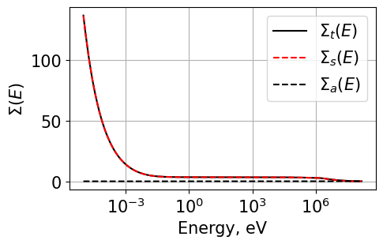

Q6 Simpsons Rule
~~~~~~~~~~~~~~~~

First we run \_test_numerical_integration() to integrate the following
polynomial using both trapezoid and simpsons rule’s for integration.

:math:`f(x) = x^3 +5x^2 -2.125x - 1.1521`

And the exact result is:

:math:`\int_{-10}^{10}f(x)dx = 3310.291333333333`

Since Simpson’s rule integrates polynomials of up to and including
degree three exactly, then we should get exact results when using
Simpson’s rule here

Simpsons rule requires an even number of ‘bins’ but can be used with an
odd number of bins which we have also implemented - when using an odd
number of bins integration will be ‘close’ but not exact - whereas an
even number of bins will provide the exact result

See: Composite Simpson’s rule for irregularly spaced data
^^^^^^^^^^^^^^^^^^^^^^^^^^^^^^^^^^^^^^^^^^^^^^^^^^^^^^^^^

https://en.wikipedia.org/wiki/Simpson%27s_rule

We can run the below cell to run a variety of integration tests to
observe the accuracy of the two implemented integration schemes

.. code:: ipython3

    # First we test the implemented numerical integration
    # functions to prove to ourselves that our methods
    # are not gibberish since latest code update
    from transportcorrection import _test_numerical_integration
    _test_numerical_integration()

.. parsed-literal::

    Now running numerical integration for various settings ...
    Simpsons rule with even N should be exact since it is of low enough polynomial order.
    Exact: 3310.291333333333
    Simpsons Rule Odd N: 3316.387964944368 | time: 0.00010156631469726562
    Simpsons Rule Even N: 3310.291333333333 | time: 5.5789947509765625e-05
    Trapezoid Rule N=10: 3376.9579999999996 | time: 5.0067901611328125e-05
    Trapezoid Rule N=20: 3326.958 | time: 4.8160552978515625e-05
    Trapezoid Rule N=30: 3317.6987407407405 | time: 4.9591064453125e-05
    Trapezoid Rule N=40: 3314.4579999999996 | time: 5.507469177246094e-05
    Trapezoid Rule N=50: 3312.9579999999996 | time: 5.1021575927734375e-05
    Trapezoid Rule N=1000: 3310.2980133533592 | time: 0.0008146762847900391
    Trapezoid Rule N=3000: 3310.292074568148 | time: 0.00018477439880371094
    Simpsons Rule N=3000: 3310.2913333333336 | time: 0.0015516281127929688
    Simpsons Rule N=2999: 3310.2913333338333 | time: 0.0015654563903808594

Now running a bunch of different calculations to compare accuracy/time.
^^^^^^^^^^^^^^^^^^^^^^^^^^^^^^^^^^^^^^^^^^^^^^^^^^^^^^^^^^^^^^^^^^^^^^^

.. code:: ipython3

    # Now we run both trapezoid and simpsons rule for a variety of N values - 25,50,100,300
    # We can compare the accuracy and runtimes of each.

    # Watt fission spectrum source
    dataFile = "./database/H1.csv"
    data = pd.read_csv(dataFile)
    energy = np.array(data['energy'])
    src = np.exp(-energy/9.880E+05)*np.sinh((2.249E-06*energy)**0.5)
    src = src / src.sum()

    # SIMPSONS INTEGRATION RULE
    print("SIMPSONS N=25")
    energyS_25, tauS_25, tau0_25, _ = solveFluxAndTRC(dataPath="./database/H1.csv",
                    isotopeMass=1.0,
                    energyN=26,
                    lowerE=1,
                    upperE=19e6,
                    src=src,
                    rule='simp',
                    plotFluxMatrix=False,
                    plotTaus=False)
    print("SIMPSONS N=50")
    energyS_50, tauS_50, _, _ = solveFluxAndTRC(dataPath="./database/H1.csv",
                    isotopeMass=1.0,
                    energyN=51,
                    lowerE=1,
                    upperE=19e6,
                    src=src,
                    rule='simp',
                    plotFluxMatrix=False,
                    plotTaus=False)
    print("SIMPSONS N=100")
    energyS_100, tauS_100, _, _ = solveFluxAndTRC(dataPath="./database/H1.csv",
                    isotopeMass=1.0,
                    energyN=101,
                    lowerE=1,
                    upperE=19e6,
                    src=src,
                    rule='simp',
                    plotFluxMatrix=False,
                    plotTaus=False)

    print("SIMPSONS N=300")
    energyS_300, tauS_300, _, _ = solveFluxAndTRC(dataPath="./database/H1.csv",
                    isotopeMass=1.0,
                    energyN=301,
                    lowerE=1,
                    upperE=19e6,
                    src=src,
                    rule='simp',
                    plotFluxMatrix=False,
                    plotTaus=False)
    print("SIMPSONS N=1000")
    energyS_1000, tauS_1000, _, _ = solveFluxAndTRC(dataPath="./database/H1.csv",
                    isotopeMass=1.0,
                    energyN=1001,
                    lowerE=1,
                    upperE=19e6,
                    src=src,
                    rule='simp',
                    plotFluxMatrix=False,
                    plotTaus=False)
    print("SIMPSONS N=3000")
    energyS_3000, tauS_3000, _, _ = solveFluxAndTRC(dataPath="./database/H1.csv",
                    isotopeMass=1.0,
                    energyN=3001,
                    lowerE=1,
                    upperE=19e6,
                    src=src,
                    rule='simp',
                    plotFluxMatrix=False,
                    plotTaus=False)
    print("SIMPSONS N=5000")
    energyS_5000, tauS_5000, _, _ = solveFluxAndTRC(dataPath="./database/H1.csv",
                    isotopeMass=1.0,
                    energyN=5001,
                    lowerE=1,
                    upperE=19e6,
                    src=src,
                    rule='simp',
                    plotFluxMatrix=False,
                    plotTaus=False)

    print("SIMPSONS N=10000")
    energyS_10000, tauS_10000, _, _ = solveFluxAndTRC(dataPath="./database/H1.csv",
                    isotopeMass=1.0,
                    energyN=10001,
                    lowerE=1,
                    upperE=19e6,
                    src=src,
                    rule='simp',
                    plotFluxMatrix=False,
                    plotTaus=False)

    # TRAPEZOID INTEGRATION RULE
    print("TRAPEZOID N=25")
    energyT_25, tauT_25, _, _ = solveFluxAndTRC(dataPath="./database/H1.csv",
                    isotopeMass=1.0,
                    energyN=26,
                    lowerE=1,
                    upperE=19e6,
                    src=src,
                    rule='trap',
                    plotFluxMatrix=False,
                    plotTaus=False)
    print("TRAPEZOID N=50")
    energyT_50, tauT_50, _, _ = solveFluxAndTRC(dataPath="./database/H1.csv",
                    isotopeMass=1.0,
                    energyN=51,
                    lowerE=1,
                    upperE=19e6,
                    src=src,
                    rule='trap',
                    plotFluxMatrix=False,
                    plotTaus=False)
    print("TRAPEZOID N=100")
    energyT_100, tauT_100, _, _ = solveFluxAndTRC(dataPath="./database/H1.csv",
                    isotopeMass=1.0,
                    energyN=101,
                    lowerE=1,
                    upperE=19e6,
                    src=src,
                    rule='trap',
                    plotFluxMatrix=False,
                    plotTaus=False)

    print("TRAPEZOID N=300")
    energyT_300, tauT_300, _, _ = solveFluxAndTRC(dataPath="./database/H1.csv",
                    isotopeMass=1.0,
                    energyN=301,
                    lowerE=1,
                    upperE=19e6,
                    src=src,
                    rule='trap',
                    plotFluxMatrix=False,
                    plotTaus=False)
    print("TRAPEZOID N=1000")
    energyT_1000, tauT_1000, _, _ = solveFluxAndTRC(dataPath="./database/H1.csv",
                    isotopeMass=1.0,
                    energyN=1001,
                    lowerE=1,
                    upperE=19e6,
                    src=src,
                    rule='trap',
                    plotFluxMatrix=False,
                    plotTaus=False)
    print("TRAPEZOID N=3000")
    energyT_3000, tauT_3000, _, _ = solveFluxAndTRC(dataPath="./database/H1.csv",
                    isotopeMass=1.0,
                    energyN=3001,
                    lowerE=1,
                    upperE=19e6,
                    src=src,
                    rule='trap',
                    plotFluxMatrix=False,
                    plotTaus=False)
    print("TRAPEZOID N=5000")
    energyT_5000, tauT_5000, _, _ = solveFluxAndTRC(dataPath="./database/H1.csv",
                    isotopeMass=1.0,
                    energyN=5001,
                    lowerE=1,
                    upperE=19e6,
                    src=src,
                    rule='trap',
                    plotFluxMatrix=False,
                    plotTaus=False)

    print("TRAPEZOID N=10000")
    energyT_10000, tauT_10000, _, _ = solveFluxAndTRC(dataPath="./database/H1.csv",
                    isotopeMass=1.0,
                    energyN=10001,
                    lowerE=1,
                    upperE=19e6,
                    src=src,
                    rule='trap',
                    plotFluxMatrix=False,
                    plotTaus=False)

.. parsed-literal::

    SIMPSONS N=25
    Time to solve for flux is 0.0003097057342529297
    Flux calculation took 0.0003352 s
    Tau calculation took 0.0004151 s
    Total time is 0.0007551 s
    SIMPSONS N=50
    Time to solve for flux is 0.0007848739624023438
    Flux calculation took 0.0008056 s
    Tau calculation took 0.0009344 s
    Total time is 0.0017433 s
    SIMPSONS N=100
    Time to solve for flux is 0.003744840621948242
    Flux calculation took 0.0037749 s
    Tau calculation took 0.0052822 s
    Total time is 0.0090611 s
    SIMPSONS N=300
    Time to solve for flux is 0.0516057014465332
    Flux calculation took 0.0516844 s
    Tau calculation took 0.0488150 s
    Total time is 0.1005077 s
    SIMPSONS N=1000
    Time to solve for flux is 0.2944059371948242
    Flux calculation took 0.2949142 s
    Tau calculation took 0.3197660 s
    Total time is 0.6147103 s
    SIMPSONS N=3000
    Time to solve for flux is 2.4245777130126953
    Flux calculation took 2.4249735 s
    Tau calculation took 2.4539604 s
    Total time is 4.8789430 s
    SIMPSONS N=5000
    Time to solve for flux is 7.581923484802246
    Flux calculation took 7.5824642 s
    Tau calculation took 7.3160963 s
    Total time is 14.8985806 s
    SIMPSONS N=10000
    Time to solve for flux is 31.9954354763031
    Flux calculation took 31.9959593 s
    Tau calculation took 32.4131505 s
    Total time is 64.4091260 s
    TRAPEZOID N=25
    Time to solve for flux is 0.00023484230041503906
    Flux calculation took 0.0002649 s
    Tau calculation took 0.0003147 s
    Total time is 0.0005846 s
    TRAPEZOID N=50
    Time to solve for flux is 0.0003452301025390625
    Flux calculation took 0.0003672 s
    Tau calculation took 0.0005801 s
    Total time is 0.0009511 s
    TRAPEZOID N=100
    Time to solve for flux is 0.0011105537414550781
    Flux calculation took 0.0011399 s
    Tau calculation took 0.0013423 s
    Total time is 0.0025089 s
    TRAPEZOID N=300
    Time to solve for flux is 0.004845142364501953
    Flux calculation took 0.0048769 s
    Tau calculation took 0.0065112 s
    Total time is 0.0113921 s
    TRAPEZOID N=1000
    Time to solve for flux is 0.030581951141357422
    Flux calculation took 0.0306883 s
    Tau calculation took 0.0378132 s
    Total time is 0.0685101 s
    TRAPEZOID N=3000
    Time to solve for flux is 0.3781712055206299
    Flux calculation took 0.3785994 s
    Tau calculation took 0.3330069 s
    Total time is 0.7116206 s
    TRAPEZOID N=5000
    Time to solve for flux is 1.015740156173706
    Flux calculation took 1.0167367 s
    Tau calculation took 1.8223386 s
    Total time is 2.8391080 s
    TRAPEZOID N=10000
    Time to solve for flux is 7.815183401107788
    Flux calculation took 7.8157234 s
    Tau calculation took 7.9559760 s
    Total time is 15.7717149 s

And plotting results …
^^^^^^^^^^^^^^^^^^^^^^

.. code:: ipython3

    Plot1d(energyT_25, tauT_25, xlabel="Energy, eV", ylabel="$\\tau(E)$", fontsize=15, marker="k-", markerfill=False, markersize=3, legend='Trap. N=25')
    Plot1d(energyS_25, tauS_25, xlabel="Energy, eV", ylabel="$\\tau(E)$", fontsize=15, marker="r--", markerfill=False, markersize=3, legend='Simp. N=25')
    Plot1d(energyS_25, tau0_25, xlabel="Energy, eV", ylabel="$\\tau(E)$", fontsize=15, marker="k--", markerfill=False, markersize=3, legend='$\\tau_0$')
    plt.savefig('./results/q6_25.png', bbox_inches='tight')

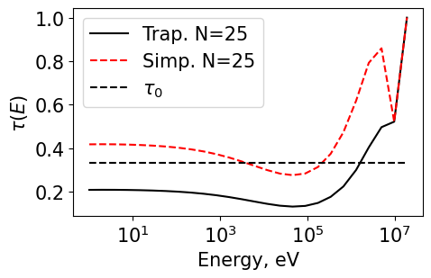

.. code:: ipython3

    Plot1d(energyT_50, tauT_50, xlabel="Energy, eV", ylabel="$\\tau(E)$", fontsize=15, marker="k-", markerfill=False, markersize=3, legend='Trap. N=50')
    Plot1d(energyS_50, tauS_50, xlabel="Energy, eV", ylabel="$\\tau(E)$", fontsize=15, marker="r--", markerfill=False, markersize=3, legend='Simp. N=50')
    Plot1d(energyS_25, tau0_25, xlabel="Energy, eV", ylabel="$\\tau(E)$", fontsize=15, marker="k--", markerfill=False, markersize=3, legend='$\\tau_0$')
    plt.savefig('./results/q6_50.png', bbox_inches='tight')

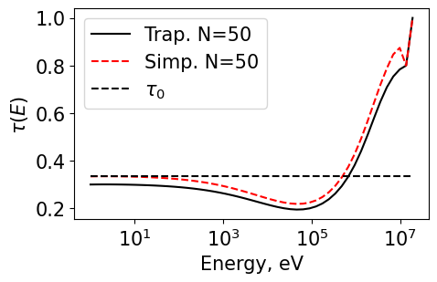

.. code:: ipython3

    Plot1d(energyT_100, tauT_100, xlabel="Energy, eV", ylabel="$\\tau(E)$", fontsize=15, marker="k-", markerfill=False, markersize=3, legend='Trap. N=100')
    Plot1d(energyS_100, tauS_100, xlabel="Energy, eV", ylabel="$\\tau(E)$", fontsize=15, marker="r--", markerfill=False, markersize=3, legend='Simp. N=100')
    Plot1d(energyS_25, tau0_25, xlabel="Energy, eV", ylabel="$\\tau(E)$", fontsize=15, marker="k--", markerfill=False, markersize=3, legend='$\\tau_0$')
    plt.savefig('./results/q6_100.png', bbox_inches='tight')

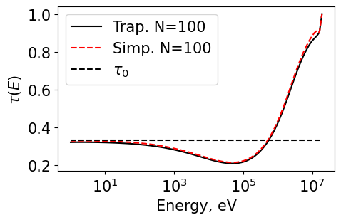

.. code:: ipython3

    Plot1d(energyT_300, tauT_300, xlabel="Energy, eV", ylabel="$\\tau(E)$", fontsize=15, marker="k-", markerfill=False, markersize=3, legend='Trap. N=300')
    Plot1d(energyS_300, tauS_300, xlabel="Energy, eV", ylabel="$\\tau(E)$", fontsize=15, marker="r--", markerfill=False, markersize=3, legend='Simp. N=300')
    Plot1d(energyS_25, tau0_25, xlabel="Energy, eV", ylabel="$\\tau(E)$", fontsize=15, marker="k--", markerfill=False, markersize=3, legend='$\\tau_0$')
    plt.savefig('./results/q6_300.png', bbox_inches='tight')

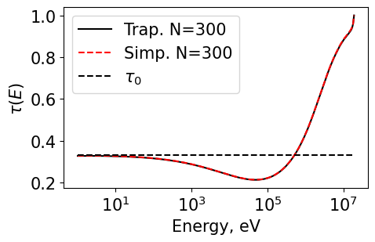

.. code:: ipython3

    Plot1d(energyT_10000, tauT_10000, xlabel="Energy, eV", ylabel="$\\tau(E)$", fontsize=15, marker="k-", markerfill=False, markersize=3, legend='Trap. N=300')
    Plot1d(energyS_10000, tauS_10000, xlabel="Energy, eV", ylabel="$\\tau(E)$", fontsize=15, marker="r--", markerfill=False, markersize=3, legend='Simp. N=300')
    Plot1d(energyS_25, tau0_25, xlabel="Energy, eV", ylabel="$\\tau(E)$", fontsize=15, marker="k--", markerfill=False, markersize=3, legend='$\\tau_0$')
    plt.savefig('./results/q6_10000.png', bbox_inches='tight')

.. code:: ipython3

    # Plotting all the Trapezoid rules integrations

    plt.rcParams['figure.figsize'] = [6, 4] # Set default figure size

    Plot1d(energyT_25, tauT_25, xlabel="Energy, eV", ylabel="$\\tau(E)$", fontsize=15, marker="r-", markerfill=False, markersize=3, legend='Trap. N=25')
    Plot1d(energyT_50, tauT_50, xlabel="Energy, eV", ylabel="$\\tau(E)$", fontsize=15, marker="b-", markerfill=False, markersize=3, legend='Trap. N=50')
    Plot1d(energyT_100, tauT_100, xlabel="Energy, eV", ylabel="$\\tau(E)$", fontsize=15, marker="g-", markerfill=False, markersize=3, legend='Trap. N=100')
    Plot1d(energyT_300, tauT_300, xlabel="Energy, eV", ylabel="$\\tau(E)$", fontsize=15, marker="m-", markerfill=False, markersize=3, legend='Trap. N=300')
    Plot1d(energyT_10000, tauT_10000, xlabel="Energy, eV", ylabel="$\\tau(E)$", fontsize=15, marker="k-", markerfill=False, markersize=3, legend='Trap. N=10000')
    Plot1d(energyS_25, tau0_25, xlabel="Energy, eV", ylabel="$\\tau(E)$", fontsize=15, marker="k--", markerfill=False, markersize=3, legend='$\\tau_0$')
    plt.grid()
    plt.savefig('./results/q6_trap.png', bbox_inches='tight')

.. image:: hw2_q456_files/hw2_q456_26_0.png

.. code:: ipython3

    # Plotting all the simpsons rules integrations
    # Note that the last two points are integrated using trapezoid rule (since simpsons rule needs 3x datapoints)
    # Thus there is a discontinuity

    plt.rcParams['figure.figsize'] = [6, 4] # Set default figure size

    Plot1d(energyS_25, tauS_25, xlabel="Energy, eV", ylabel="$\\tau(E)$", fontsize=15, marker="r-", markerfill=False, markersize=3, legend='Simp. N=25')
    Plot1d(energyS_50, tauS_50, xlabel="Energy, eV", ylabel="$\\tau(E)$", fontsize=15, marker="b-", markerfill=False, markersize=3, legend='Simp. N=50')
    Plot1d(energyS_100, tauS_100, xlabel="Energy, eV", ylabel="$\\tau(E)$", fontsize=15, marker="g-", markerfill=False, markersize=3, legend='Simp. N=100')
    Plot1d(energyS_300, tauS_300, xlabel="Energy, eV", ylabel="$\\tau(E)$", fontsize=15, marker="m-", markerfill=False, markersize=3, legend='Simp. N=300')
    Plot1d(energyS_10000, tauS_10000, xlabel="Energy, eV", ylabel="$\\tau(E)$", fontsize=15, marker="k-", markerfill=False, markersize=3, legend='Simp. N=10000')
    Plot1d(energyS_25, tau0_25, xlabel="Energy, eV", ylabel="$\\tau(E)$", fontsize=15, marker="k--", markerfill=False, markersize=3, legend='$\\tau_0$')
    plt.grid()
    plt.savefig('./results/q6_simp.png', bbox_inches='tight')

.. image:: hw2_q456_files/hw2_q456_27_0.png

Lets observe why the runtimes are so different
^^^^^^^^^^^^^^^^^^^^^^^^^^^^^^^^^^^^^^^^^^^^^^

First compare the weight matrices (they look very similar for each
method)

.. code:: ipython3

    from transportcorrection import _scatteringWeightGrabber
    W_trap = _scatteringWeightGrabber(energy=energyT_10000,A=1.0,intRule='trap')
    W_simp = _scatteringWeightGrabber(energy=energyT_10000,A=1.0,intRule='simp')
    plot_matrix(W_trap, black_white=False)
    plot_matrix(W_simp, black_white=False)

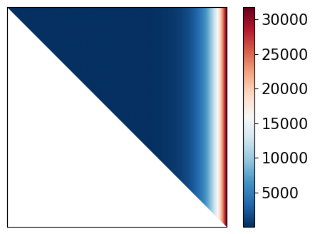

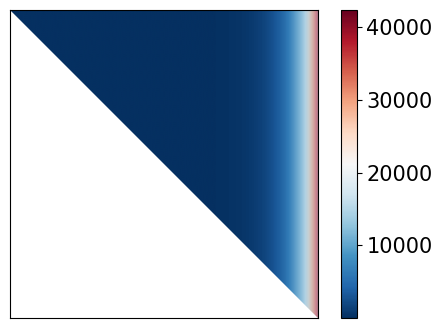

Then compare the time it takes to assemble the matrices (this is the likely reason….)
^^^^^^^^^^^^^^^^^^^^^^^^^^^^^^^^^^^^^^^^^^^^^^^^^^^^^^^^^^^^^^^^^^^^^^^^^^^^^^^^^^^^^

.. code:: ipython3

    start = time.time()
    W_trap = _scatteringWeightGrabber(energy=energyS_10000,A=1.0,intRule='trap')
    end = time.time()
    print("Trapezoid rule scattering matrix assembly time =", end-start)

    start = time.time()
    W_simp = _scatteringWeightGrabber(energy=energyS_10000,A=1.0,intRule='simp')
    end = time.time()
    print("Simpsons rule scattering matrix assembly time =", end-start)

.. parsed-literal::

    time = 0.11665654182434082
    time = 23.96303963661194

