.. _proj4_notebook:

HOMEWORK 4
==========

.. code:: ipython3

    # Imports
    from IPython.display import Image
    import matplotlib.pyplot as plt
    from matplotlib import rcParams
    import numpy as np
    import time

    # NEM and Serpent
    from NEM import CartesianNem1D, GetSerpentRes, Plot1d, Plot2d
    import serpentTools

    # Default values
    FONT_SIZE = 16  # font size for plotting purposes
    # rcParams['figure.dpi'] = 300
    plt.rcParams['figure.figsize'] = [6, 4] # Set default figure size

Setup
-----

**Universes** within the colorset: - Upper left **F12** - 2.6%
UO\ :math:`_2` - Upper right **Ref** - stainless steel (with water for
PWR) - Bottom left **F2** - 4.55% UO\ :math:`_2` with 8%
Gd\ :math:`_2`\ O\ :math:`_3` - Bottom right **F11** - 2.6%
UO\ :math:`_2`

.. code:: ipython3

    case = 'SMR'

    # Show the image of the case being used.
    imgFile = './serpent/{}/{}_Ref_2D_2g_geom1.png'.format(case, case)

    Image(imgFile,  width=250, height=250)

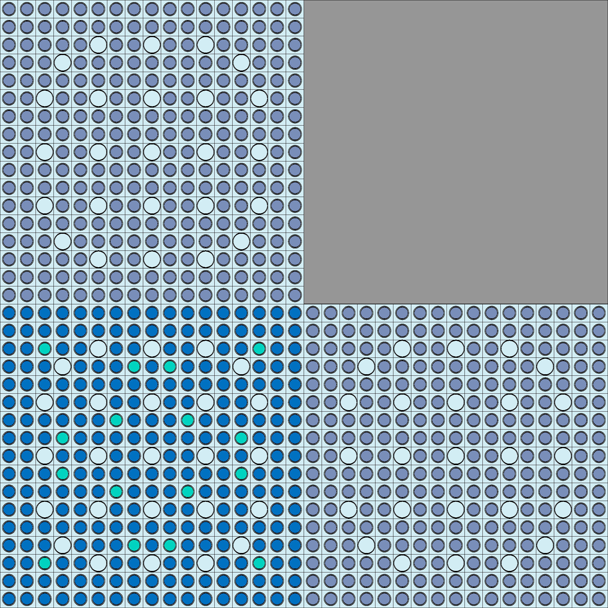

.. code:: ipython3

    # Detector file and results file from serpent
    detFile = './serpent/{}/{}_Ref_2D_2g_det0.m'.format(case, case)
    resFile = './serpent/{}/{}_Ref_2D_2g_res.m'.format(case, case)

    # Get detector file
    det = serpentTools.read(detFile)
    xtally = det.detectors['flux_fast'].x[:, 2]

    # assembly dimensions
    dx, dy = 21.42, 21.42  # cm  - assembly length

.. code:: ipython3

    # which row of thne assembly we are solving for ...
    #   Row 1 means the mesh tallies will be obtained for F2 and F11
    #   Row 2 means the mesh tallies will be obtained for F12 and the reflector
    # solverow = 2

    # Axis selection -
    #   0 -> mesh tallies obtained the columns (y-averaged) (x dir flux)
    #   1 -> mesh tallies obtained over the rows (x-averaged) (y dir flux)
    # axis_number = 0

    # xtally = det.detectors['flux_fast'].x[:, 2]
    # if solverow == 1:
    #     fastHetFlux = det.detectors['flux_fast'].tallies[0:51].mean(axis=axis_number)
    #     thermalHetFlux = det.detectors['flux_thermal'].tallies[0:51].mean(axis=axis_number)
    #     universes = ['F2', 'F11']
    # else:
    #     fastHetFlux = det.detectors['flux_fast'].tallies[51:].mean(axis=axis_number)
    #     thermalHetFlux = det.detectors['flux_thermal'].tallies[51:].mean(axis=axis_number)
    #     universes = ['F12', 'Ref']

    # xs1, bc1 = GetSerpentRes(resFile, universes[0], 0)
    # xs2, bc2 = GetSerpentRes(resFile, universes[1], 0)

Question 1
----------

Solve in the y directions by accounting for the transverse leakages in the x direction.
'''''''''''''''''''''''''''''''''''''''''''''''''''''''''''''''''''''''''''''''''''''''

.. code:: ipython3

    # Get fluxes in x and y direction on the top and the bottom
    fastHetFlux_x_bottom = det.detectors['flux_fast'].tallies[0:51, :].mean(axis=0)
    thermalHetFlux_x_bottom = det.detectors['flux_thermal'].tallies[0:51, :].mean(axis=0)

    fastHetFlux_y_left = det.detectors['flux_fast'].tallies[:, 0:51].mean(axis=1)
    thermalHetFlux_y_left = det.detectors['flux_thermal'].tallies[:, 0:51].mean(axis=1)

    fastHetFlux_x_top = det.detectors['flux_fast'].tallies[51:, :].mean(axis=0)
    thermalHetFlux_x_top = det.detectors['flux_thermal'].tallies[51:, :].mean(axis=0)

    fastHetFlux_y_right = det.detectors['flux_fast'].tallies[:, 51:].mean(axis=1)
    thermalHetFlux_y_right = det.detectors['flux_thermal'].tallies[:, 51:].mean(axis=1)

    # Get xs and BC for each node
    xs_f12, bc_f12 =  GetSerpentRes(resFile, 'F12', 0)
    xs_ref, bc_ref =  GetSerpentRes(resFile, 'Ref', 0)
    xs_f2, bc_f2 =  GetSerpentRes(resFile, 'F2', 0)
    xs_f11, bc_f11 =  GetSerpentRes(resFile, 'F11', 0)

    #########################################
    # Setup transverse leakages for each node
    #########################################

    # F12
    trLeakage_f12 = {}
    trLeakage_f12['eL'] = bc_ref['nJnet'] - bc_ref['sJnet']
    trLeakage_f12['eD'] = xs_ref['diff']
    trLeakage_f12['edx'] = dx

    trLeakage_f12['wL'] = bc_f12['nJnet'] - bc_f12['sJnet'] # use values from the node itself (since it is reflective ...)
    trLeakage_f12['wD'] = xs_f12['diff']
    trLeakage_f12['wdx'] = dx

    trLeakage_f12['nL'] = bc_f12['eJnet'] - bc_f12['wJnet']
    trLeakage_f12['nD'] = xs_f12['diff']
    trLeakage_f12['ndy'] = dy

    trLeakage_f12['sL'] = bc_f2['eJnet'] - bc_f2['wJnet']
    trLeakage_f12['sD'] = xs_f2['diff']
    trLeakage_f12['sdy'] = dy

    # F2
    trLeakage_f2 = {}
    trLeakage_f2['eL'] = bc_f11['nJnet'] - bc_f11['sJnet']
    trLeakage_f2['eD'] = xs_f11['diff']
    trLeakage_f2['edx'] = dx

    trLeakage_f2['wL'] = bc_f2['nJnet'] - bc_f2['sJnet'] # use values from the node itself (since it is reflective ...)
    trLeakage_f2['wD'] = xs_f2['diff']
    trLeakage_f2['wdx'] = dx

    trLeakage_f2['nL'] = bc_f12['eJnet'] - bc_f12['wJnet']
    trLeakage_f2['nD'] = xs_f12['diff']
    trLeakage_f2['ndy'] = dy

    trLeakage_f2['sL'] = bc_f2['eJnet'] - bc_f2['wJnet']
    trLeakage_f2['sD'] = xs_f2['diff']
    trLeakage_f2['sdy'] = dy

    # Ref
    trLeakage_ref = {}
    trLeakage_ref['eL'] = bc_ref['nJnet'] - bc_ref['sJnet']
    trLeakage_ref['eD'] = xs_ref['diff']
    trLeakage_ref['edx'] = dx

    trLeakage_ref['wL'] = bc_f12['nJnet'] - bc_f12['sJnet'] # use values from the node itself (since it is reflective ...)
    trLeakage_ref['wD'] = xs_f12['diff']
    trLeakage_ref['wdx'] = dx

    trLeakage_ref['nL'] = bc_ref['eJnet'] - bc_ref['wJnet']
    trLeakage_ref['nD'] = xs_ref['diff']
    trLeakage_ref['ndy'] = dy

    trLeakage_ref['sL'] = bc_f11['eJnet'] - bc_f11['wJnet']
    trLeakage_ref['sD'] = xs_f11['diff']
    trLeakage_ref['sdy'] = dy

    # F11
    trLeakage_f11 = {}
    trLeakage_f11['eL'] = bc_f11['nJnet'] - bc_f11['sJnet']
    trLeakage_f11['eD'] = xs_f11['diff']
    trLeakage_f11['edx'] = dx

    trLeakage_f11['wL'] = bc_f2['nJnet'] - bc_f2['sJnet'] # use values from the node itself (since it is reflective ...)
    trLeakage_f11['wD'] = xs_f2['diff']
    trLeakage_f11['wdx'] = dx

    trLeakage_f11['nL'] = bc_ref['eJnet'] - bc_ref['wJnet']
    trLeakage_f11['nD'] = xs_ref['diff']
    trLeakage_f11['ndy'] = dy

    trLeakage_f11['sL'] = bc_f11['eJnet'] - bc_f11['wJnet']
    trLeakage_f11['sD'] = xs_f11['diff']
    trLeakage_f11['sdy'] = dy

    start_time = time.time()

    # Solve for the F12
    nem_f12 = CartesianNem1D(dx, dy, xs_f12, bc_f12, trLeakage_f12, 'y')
    nem_f12.TransverseLeakageCoef()  # obtain the coefficients of the TL
    nem_f12.GetExpansionCoeffs()

    nem_f2 = CartesianNem1D(dx, dy, xs_f2, bc_f2, trLeakage_f2, 'y')
    nem_f2.TransverseLeakageCoef()  # obtain the coefficients of the TL
    nem_f2.GetExpansionCoeffs()

    nem_ref = CartesianNem1D(dx, dy, xs_ref, bc_ref, trLeakage_ref, 'y')
    nem_ref.TransverseLeakageCoef()  # obtain the coefficients of the TL
    nem_ref.GetExpansionCoeffs()

    nem_f11 = CartesianNem1D(dx, dy, xs_f11, bc_f11, trLeakage_f11, 'y')
    nem_f11.TransverseLeakageCoef()  # obtain the coefficients of the TL
    nem_f11.GetExpansionCoeffs()

    # get results
    xvals = np.linspace(-dx/2, +dx/2, 51)
    yvals = xvals

    flux_f12 = nem_f12.GetHomogFlux(yvals)
    flux_f2 = nem_f2.GetHomogFlux(yvals)
    flux_ref = nem_ref.GetHomogFlux(yvals)
    flux_f11 = nem_f11.GetHomogFlux(yvals)

    end_time = time.time()

    print("Total time =", end_time - start_time)

.. parsed-literal::

    SERPENT Serpent 2.2.1 found in ./serpent/SMR/SMR_Ref_2D_2g_res.m, but version 2.1.31 is defined in settings
      Attempting to read anyway. Please report strange behaviors/failures to developers.
    SERPENT Serpent 2.2.1 found in ./serpent/SMR/SMR_Ref_2D_2g_res.m, but version 2.1.31 is defined in settings
      Attempting to read anyway. Please report strange behaviors/failures to developers.
    SERPENT Serpent 2.2.1 found in ./serpent/SMR/SMR_Ref_2D_2g_res.m, but version 2.1.31 is defined in settings
      Attempting to read anyway. Please report strange behaviors/failures to developers.
    SERPENT Serpent 2.2.1 found in ./serpent/SMR/SMR_Ref_2D_2g_res.m, but version 2.1.31 is defined in settings
      Attempting to read anyway. Please report strange behaviors/failures to developers.

.. parsed-literal::

    Total time = 0.30920910835266113

.. code:: ipython3

    # Plotting fast flux on left side
    plt.figure()
    Plot1d(xvals+10.71, flux_f12[0,:], xlabel="position, cm",
           ylabel='Flux distribution',
           fontsize=16, marker="-r", markersize=6)
    Plot1d(xvals-10.71, flux_f2[0,:], xlabel="position, cm",
           ylabel='Flux distribution',
           fontsize=16, marker="-b", markersize=6)
    Plot1d(xtally, fastHetFlux_x_bottom, xlabel="position, cm",
           ylabel='Fast flux distribution',
           fontsize=16, marker="-k", markersize=6)

    plt.legend(["F12", "F2", "Serpent"])

    # Plotting thermal flux on left side
    plt.figure()
    Plot1d(xvals+10.71, flux_f12[1,:], xlabel="position, cm",
           ylabel='Flux distribution',
           fontsize=16, marker="-r", markersize=6)
    Plot1d(xvals-10.71, flux_f2[1,:], xlabel="position, cm",
           ylabel='Flux distribution',
           fontsize=16, marker="-b", markersize=6)
    Plot1d(xtally, thermalHetFlux_y_left, xlabel="position, cm",
           ylabel='Thermal flux distribution',
           fontsize=16, marker="-k", markersize=6)
    plt.legend(["F12", "F2", "Serpent"])

.. parsed-literal::

    <matplotlib.legend.Legend at 0x7f78dd19d3a0>

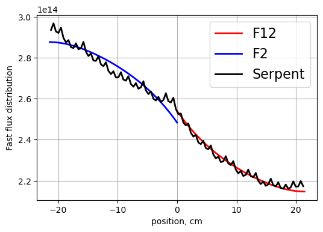

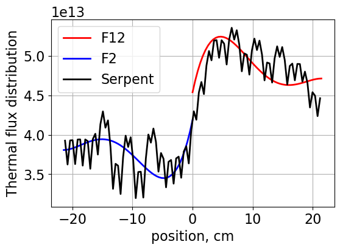

.. code:: ipython3

    # Plotting fast flux on right side
    plt.figure()
    Plot1d(xvals+10.71, flux_ref[0,:], xlabel="position, cm",
           ylabel='Flux distribution',
           fontsize=16, marker="-r", markersize=6)
    Plot1d(xvals-10.71, flux_f11[0,:], xlabel="position, cm",
           ylabel='Flux distribution',
           fontsize=16, marker="-b", markersize=6)
    Plot1d(xtally, fastHetFlux_y_right, xlabel="position, cm",
           ylabel='Fast flux distribution',
           fontsize=16, marker="-k", markersize=6)
    plt.legend(["Ref.", "F11", "Serpent"])

    # Plotting thermal flux on right side
    plt.figure()
    Plot1d(xvals+10.71, flux_ref[1,:], xlabel="position, cm",
           ylabel='Flux distribution',
           fontsize=16, marker="-r", markersize=6)
    Plot1d(xvals-10.71, flux_f11[1,:], xlabel="position, cm",
           ylabel='Flux distribution',
           fontsize=16, marker="-b", markersize=6)
    Plot1d(xtally, thermalHetFlux_y_right, xlabel="position, cm",
           ylabel='Thermal flux distribution',
           fontsize=16, marker="-k", markersize=6)
    plt.legend(["Ref.", "F11", "Serpent"])

.. parsed-literal::

    <matplotlib.legend.Legend at 0x7f78dd242a20>

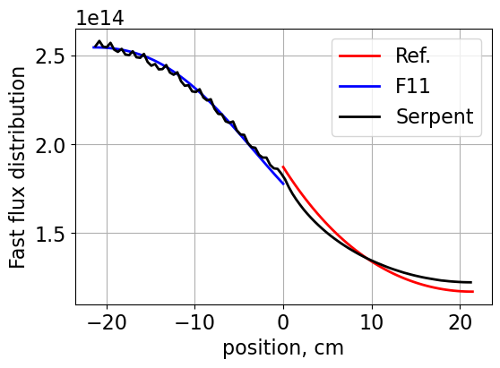

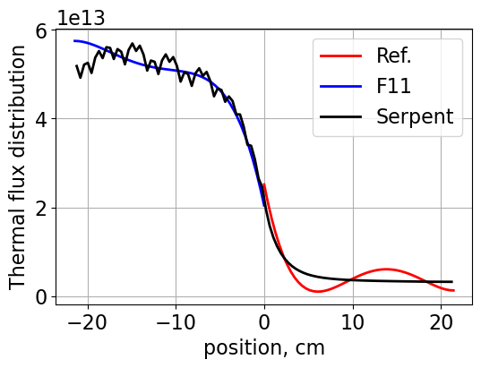

.. code:: ipython3

    # Plotting 2D thermal and fast fluxes
    spacing = np.linspace(-dx, dx, 102)

    # Fast flux
    plt.figure()
    Plot2d(xvals=spacing, yvals=spacing, vals=det.detectors['flux_fast'].tallies, cmap='RdBu_r', figsize=(4,3))

    # Thermal flux
    plt.figure()
    Plot2d(xvals=spacing, yvals=spacing, vals=det.detectors['flux_thermal'].tallies, cmap='RdBu_r', figsize=(4,3))

.. parsed-literal::

    <Figure size 600x400 with 0 Axes>

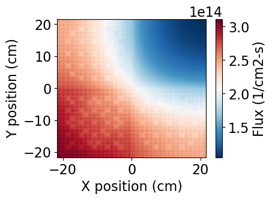

.. parsed-literal::

    <Figure size 600x400 with 0 Axes>

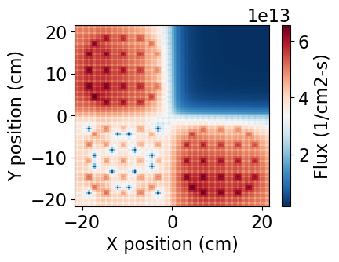

.. code:: ipython3

    # Getting discontinuity factors
    print('North F12')
    print('gr1={:.3f}, gr2={:.3f} NEM'.format(nem_f12.northDFs[0], nem_f12.northDFs[1]))
    print('gr1={:.3f}, gr2={:.3f} Serpent'.format(nem_f12.bc['nDF'][0], nem_f12.bc['nDF'][1]))

    print('South F12')
    print('gr1={:.3f}, gr2={:.3f} NEM'.format(nem_f12.southDFs[0], nem_f12.southDFs[1]))
    print('gr1={:.3f}, gr2={:.3f} Serpent'.format(nem_f12.bc['sDF'][0], nem_f12.bc['sDF'][1]))

    print()

    print('North F2')
    print('gr1={:.3f}, gr2={:.3f} NEM'.format(nem_f2.northDFs[0], nem_f2.northDFs[1]))
    print('gr1={:.3f}, gr2={:.3f} Serpent'.format(nem_f2.bc['nDF'][0], nem_f2.bc['nDF'][1]))

    print('South F2')
    print('gr1={:.3f}, gr2={:.3f} NEM'.format(nem_f2.southDFs[0], nem_f2.southDFs[1]))
    print('gr1={:.3f}, gr2={:.3f} Serpent'.format(nem_f2.bc['sDF'][0], nem_f2.bc['sDF'][1]))

    print()

    print('North F11')
    print('gr1={:.3f}, gr2={:.3f} NEM'.format(nem_f11.northDFs[0], nem_f11.northDFs[1]))
    print('gr1={:.3f}, gr2={:.3f} Serpent'.format(nem_f11.bc['nDF'][0], nem_f11.bc['nDF'][1]))

    print('South F11')
    print('gr1={:.3f}, gr2={:.3f} NEM'.format(nem_f11.southDFs[0], nem_f11.southDFs[1]))
    print('gr1={:.3f}, gr2={:.3f} Serpent'.format(nem_f11.bc['sDF'][0], nem_f11.bc['sDF'][1]))

    print()

    print('North Ref')
    print('gr1={:.3f}, gr2={:.3f} NEM'.format(nem_ref.northDFs[0], nem_ref.northDFs[1]))
    print('gr1={:.3f}, gr2={:.3f} Serpent'.format(nem_ref.bc['nDF'][0], nem_ref.bc['nDF'][1]))

    print('South Ref')
    print('gr1={:.3f}, gr2={:.3f} NEM'.format(nem_ref.southDFs[0], nem_ref.southDFs[1]))
    print('gr1={:.3f}, gr2={:.3f} Serpent'.format(nem_ref.bc['sDF'][0], nem_ref.bc['sDF'][1]))

.. parsed-literal::

    North F12
    gr1=1.008, gr2=0.974 NEM
    gr1=0.997, gr2=0.973 Serpent
    South F12
    gr1=0.995, gr2=0.954 NEM
    gr1=1.006, gr2=0.951 Serpent

    North F2
    gr1=1.018, gr2=1.034 NEM
    gr1=1.006, gr2=1.057 Serpent
    South F2
    gr1=1.017, gr2=1.074 NEM
    gr1=1.026, gr2=1.063 Serpent

    North F11
    gr1=1.030, gr2=1.084 NEM
    gr1=1.048, gr2=1.027 Serpent
    South F11
    gr1=1.000, gr2=0.927 NEM
    gr1=0.990, gr2=0.937 Serpent

    North Ref
    gr1=1.045, gr2=2.482 NEM
    gr1=1.052, gr2=1.012 Serpent
    South Ref
    gr1=0.978, gr2=0.880 NEM
    gr1=0.974, gr2=1.012 Serpent

.. code:: ipython3

    trl_f12 = nem_f12.GetTrVals(yvals)
    avTr_f12 = (bc_f12['eJnet'] - bc_f12['wJnet'])/dy

    trl_f2 = nem_f2.GetTrVals(yvals)
    avTr_f2 = (bc_f2['eJnet'] - bc_f2['wJnet'])/dy

    trl_ref = nem_ref.GetTrVals(yvals)
    avTr_ref = (bc_ref['eJnet'] - bc_ref['wJnet'])/dy

    trl_f11 = nem_f11.GetTrVals(yvals)
    avTr_f11 = (bc_f11['eJnet'] - bc_f11['wJnet'])/dy

.. code:: ipython3

    plt.figure()
    Plot1d(xvals-10.71, np.full(51, avTr_f2[0]), xlabel=None,
           ylabel=None,
           fontsize=16, marker="-.r", markersize=6)
    Plot1d(xvals+10.71, np.full(51, avTr_f12[0]), xlabel=None,
           ylabel=None,
           fontsize=16, marker="-.b", markersize=6)
    Plot1d(xvals-10.71, trl_f2[0,:], xlabel=None,
           ylabel=None,
           fontsize=16, marker="-r", markersize=6)
    Plot1d(xvals+10.71, trl_f12[0,:], xlabel=None,
           ylabel=None,
           fontsize=16, marker="-b", markersize=6)
    plt.grid()
    plt.ylabel("Fast Transverse leakage (1/cm2-s)", fontsize=13)
    plt.xlabel("Y position (cm)")
    plt.legend(['F12 (avg)', 'F2 (avg)', 'F12', 'F2'])

.. parsed-literal::

    <matplotlib.legend.Legend at 0x7f78dcdc6ab0>

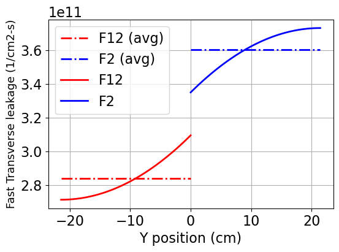

.. code:: ipython3

    plt.figure()
    Plot1d(xvals-10.71, np.full(51, avTr_f2[1]), xlabel=None,
           ylabel=None,
           fontsize=16, marker="-.r", markersize=6)
    Plot1d(xvals+10.71, np.full(51, avTr_f12[1]), xlabel=None,
           ylabel=None,
           fontsize=16, marker="-.b", markersize=6)
    Plot1d(xvals-10.71, trl_f2[1,:], xlabel=None,
           ylabel=None,
           fontsize=16, marker="-r", markersize=6)
    Plot1d(xvals+10.71, trl_f12[1,:], xlabel=None,
           ylabel=None,
           fontsize=16, marker="-b", markersize=6)
    plt.grid()
    plt.ylabel("Thermal Transverse leakage (1/cm2-s)", fontsize=13)
    plt.xlabel("Y position (cm)")
    plt.legend(['F12 (avg)', 'F2 (avg)', 'F12', 'F2'])

.. parsed-literal::

    <matplotlib.legend.Legend at 0x7f78dcbf6c00>

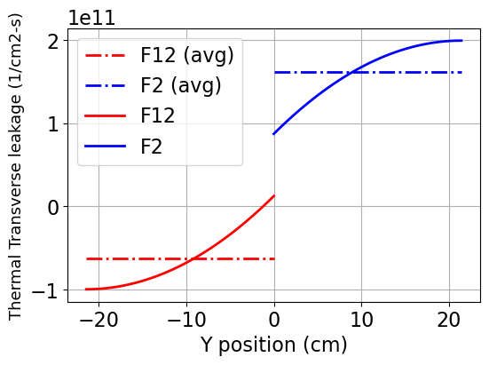

.. code:: ipython3

    plt.figure()
    Plot1d(xvals-10.71, np.full(51, avTr_f11[0]), xlabel=None,
           ylabel=None,
           fontsize=16, marker="-.r", markersize=6)
    Plot1d(xvals+10.71, np.full(51, avTr_ref[0]), xlabel=None,
           ylabel=None,
           fontsize=16, marker="-.b", markersize=6)
    Plot1d(xvals-10.71, trl_f11[0,:], xlabel=None,
           ylabel=None,
           fontsize=16, marker="-r", markersize=6)
    Plot1d(xvals+10.71, trl_ref[0,:], xlabel=None,
           ylabel=None,
           fontsize=16, marker="-b", markersize=6)
    plt.grid()
    plt.ylabel("Fast Transverse leakage (1/cm2-s)", fontsize=13)
    plt.xlabel("Y position (cm)")
    plt.legend(['F11 (avg)', 'Ref.(avg)', 'F11', 'Ref.'])

.. parsed-literal::

    <matplotlib.legend.Legend at 0x7f78dcecbec0>

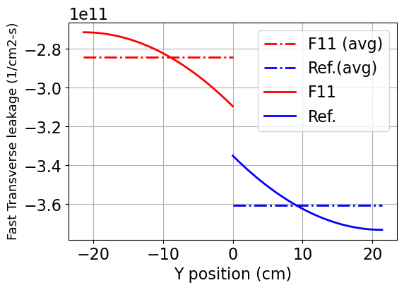

.. code:: ipython3

    plt.figure()
    Plot1d(xvals-10.71, np.full(51, avTr_f11[1]), xlabel=None,
           ylabel=None,
           fontsize=16, marker="-.r", markersize=6)
    Plot1d(xvals+10.71, np.full(51, avTr_ref[1]), xlabel=None,
           ylabel=None,
           fontsize=16, marker="-.b", markersize=6)
    Plot1d(xvals-10.71, trl_f11[1,:], xlabel=None,
           ylabel=None,
           fontsize=16, marker="-r", markersize=6)
    Plot1d(xvals+10.71, trl_ref[1,:], xlabel=None,
           ylabel=None,
           fontsize=16, marker="-b", markersize=6)
    plt.grid()
    plt.ylabel("Thermal Transverse leakage (1/cm2-s)", fontsize=13)
    plt.xlabel("Y position (cm)")
    plt.legend(['F11 (avg)', 'Ref.(avg)', 'F11', 'Ref.'])

.. parsed-literal::

    <matplotlib.legend.Legend at 0x7f78dce8e030>

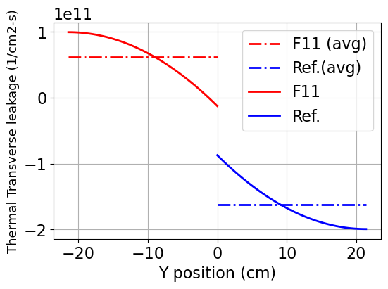

Question 2
----------

Repeat of question 1 but using CMM diffusion coefficients instead.
''''''''''''''''''''''''''''''''''''''''''''''''''''''''''''''''''

.. code:: ipython3

    # Get fluxes in x and y direction on the top and the bottom
    fastHetFlux_x_bottom = det.detectors['flux_fast'].tallies[0:51, :].mean(axis=0)
    thermalHetFlux_x_bottom = det.detectors['flux_thermal'].tallies[0:51, :].mean(axis=0)

    fastHetFlux_y_left = det.detectors['flux_fast'].tallies[:, 0:51].mean(axis=1)
    thermalHetFlux_y_left = det.detectors['flux_thermal'].tallies[:, 0:51].mean(axis=1)

    fastHetFlux_x_top = det.detectors['flux_fast'].tallies[51:, :].mean(axis=0)
    thermalHetFlux_x_top = det.detectors['flux_thermal'].tallies[51:, :].mean(axis=0)

    fastHetFlux_y_right = det.detectors['flux_fast'].tallies[:, 51:].mean(axis=1)
    thermalHetFlux_y_right = det.detectors['flux_thermal'].tallies[:, 51:].mean(axis=1)

    # Get xs and BC for each node
    xs_f12, bc_f12 =  GetSerpentRes(resFile, 'F12', 0)
    xs_ref, bc_ref =  GetSerpentRes(resFile, 'Ref', 0)
    xs_f2, bc_f2 =  GetSerpentRes(resFile, 'F2', 0)
    xs_f11, bc_f11 =  GetSerpentRes(resFile, 'F11', 0)

.. parsed-literal::

    SERPENT Serpent 2.2.1 found in ./serpent/SMR/SMR_Ref_2D_2g_res.m, but version 2.1.31 is defined in settings
      Attempting to read anyway. Please report strange behaviors/failures to developers.
    SERPENT Serpent 2.2.1 found in ./serpent/SMR/SMR_Ref_2D_2g_res.m, but version 2.1.31 is defined in settings
      Attempting to read anyway. Please report strange behaviors/failures to developers.
    SERPENT Serpent 2.2.1 found in ./serpent/SMR/SMR_Ref_2D_2g_res.m, but version 2.1.31 is defined in settings
      Attempting to read anyway. Please report strange behaviors/failures to developers.
    SERPENT Serpent 2.2.1 found in ./serpent/SMR/SMR_Ref_2D_2g_res.m, but version 2.1.31 is defined in settings
      Attempting to read anyway. Please report strange behaviors/failures to developers.

.. code:: ipython3

    # Update to CMM diffusion coeffs.
    xs_f12['diff'] = xs_f12['cmmdiff']
    xs_ref['diff'] = xs_ref['cmmdiff']
    xs_f2['diff'] = xs_f2['cmmdiff']
    xs_f11['diff'] = xs_f11['cmmdiff']

    #########################################
    # Setup transverse leakages for each node
    #########################################

    # F12
    trLeakage_f12 = {}
    trLeakage_f12['eL'] = bc_ref['nJnet'] - bc_ref['sJnet']
    trLeakage_f12['eD'] = xs_ref['diff']
    trLeakage_f12['edx'] = dx

    trLeakage_f12['wL'] = bc_f12['nJnet'] - bc_f12['sJnet'] # use values from the node itself (since it is reflective ...)
    trLeakage_f12['wD'] = xs_f12['diff']
    trLeakage_f12['wdx'] = dx

    trLeakage_f12['nL'] = bc_f12['eJnet'] - bc_f12['wJnet']
    trLeakage_f12['nD'] = xs_f12['diff']
    trLeakage_f12['ndy'] = dy

    trLeakage_f12['sL'] = bc_f2['eJnet'] - bc_f2['wJnet']
    trLeakage_f12['sD'] = xs_f2['diff']
    trLeakage_f12['sdy'] = dy

    # F2
    trLeakage_f2 = {}
    trLeakage_f2['eL'] = bc_f11['nJnet'] - bc_f11['sJnet']
    trLeakage_f2['eD'] = xs_f11['diff']
    trLeakage_f2['edx'] = dx

    trLeakage_f2['wL'] = bc_f2['nJnet'] - bc_f2['sJnet'] # use values from the node itself (since it is reflective ...)
    trLeakage_f2['wD'] = xs_f2['diff']
    trLeakage_f2['wdx'] = dx

    trLeakage_f2['nL'] = bc_f12['eJnet'] - bc_f12['wJnet']
    trLeakage_f2['nD'] = xs_f12['diff']
    trLeakage_f2['ndy'] = dy

    trLeakage_f2['sL'] = bc_f2['eJnet'] - bc_f2['wJnet']
    trLeakage_f2['sD'] = xs_f2['diff']
    trLeakage_f2['sdy'] = dy

    # Ref
    trLeakage_ref = {}
    trLeakage_ref['eL'] = bc_ref['nJnet'] - bc_ref['sJnet']
    trLeakage_ref['eD'] = xs_ref['diff']
    trLeakage_ref['edx'] = dx

    trLeakage_ref['wL'] = bc_f12['nJnet'] - bc_f12['sJnet'] # use values from the node itself (since it is reflective ...)
    trLeakage_ref['wD'] = xs_f12['diff']
    trLeakage_ref['wdx'] = dx

    trLeakage_ref['nL'] = bc_ref['eJnet'] - bc_ref['wJnet']
    trLeakage_ref['nD'] = xs_ref['diff']
    trLeakage_ref['ndy'] = dy

    trLeakage_ref['sL'] = bc_f11['eJnet'] - bc_f11['wJnet']
    trLeakage_ref['sD'] = xs_f11['diff']
    trLeakage_ref['sdy'] = dy

    # F11
    trLeakage_f11 = {}
    trLeakage_f11['eL'] = bc_f11['nJnet'] - bc_f11['sJnet']
    trLeakage_f11['eD'] = xs_f11['diff']
    trLeakage_f11['edx'] = dx

    trLeakage_f11['wL'] = bc_f2['nJnet'] - bc_f2['sJnet'] # use values from the node itself (since it is reflective ...)
    trLeakage_f11['wD'] = xs_f2['diff']
    trLeakage_f11['wdx'] = dx

    trLeakage_f11['nL'] = bc_ref['eJnet'] - bc_ref['wJnet']
    trLeakage_f11['nD'] = xs_ref['diff']
    trLeakage_f11['ndy'] = dy

    trLeakage_f11['sL'] = bc_f11['eJnet'] - bc_f11['wJnet']
    trLeakage_f11['sD'] = xs_f11['diff']
    trLeakage_f11['sdy'] = dy

    # Solve for the F12
    nem_f12 = CartesianNem1D(dx, dy, xs_f12, bc_f12, trLeakage_f12, 'y')
    nem_f12.TransverseLeakageCoef()  # obtain the coefficients of the TL
    nem_f12.GetExpansionCoeffs()

    nem_f2 = CartesianNem1D(dx, dy, xs_f2, bc_f2, trLeakage_f2, 'y')
    nem_f2.TransverseLeakageCoef()  # obtain the coefficients of the TL
    nem_f2.GetExpansionCoeffs()

    nem_ref = CartesianNem1D(dx, dy, xs_ref, bc_ref, trLeakage_ref, 'y')
    nem_ref.TransverseLeakageCoef()  # obtain the coefficients of the TL
    nem_ref.GetExpansionCoeffs()

    nem_f11 = CartesianNem1D(dx, dy, xs_f11, bc_f11, trLeakage_f11, 'y')
    nem_f11.TransverseLeakageCoef()  # obtain the coefficients of the TL
    nem_f11.GetExpansionCoeffs()

    # get results
    xvals = np.linspace(-dx/2, +dx/2, 51)
    yvals = xvals

    flux_f12_cmm = nem_f12.GetHomogFlux(yvals)
    flux_f2_cmm = nem_f2.GetHomogFlux(yvals)
    flux_ref_cmm = nem_ref.GetHomogFlux(yvals)
    flux_f11_cmm = nem_f11.GetHomogFlux(yvals)

.. code:: ipython3

    # Plotting fast flux on left side
    plt.figure()
    Plot1d(xvals+10.71, flux_f12[0,:], xlabel="position, cm",
           ylabel='Flux distribution',
           fontsize=16, marker="-r", markersize=6)
    Plot1d(xvals-10.71, flux_f2[0,:], xlabel="position, cm",
           ylabel='Flux distribution',
           fontsize=16, marker="-b", markersize=6)

    Plot1d(xvals+10.71, flux_f12_cmm[0,:], xlabel="position, cm",
           ylabel='Flux distribution',
           fontsize=16, marker="--r", markersize=6)
    Plot1d(xvals-10.71, flux_f2_cmm[0,:], xlabel="position, cm",
           ylabel='Flux distribution',
           fontsize=16, marker="--b", markersize=6)

    Plot1d(xtally, fastHetFlux_x_bottom, xlabel="position, cm",
           ylabel='Fast flux distribution',
           fontsize=16, marker="-k", markersize=6)

    plt.legend(["F12 inf", "F2 inf", "F12 CMM", "F2 CMM", "Serpent"])

    # Plotting thermal flux on left side
    plt.figure()
    Plot1d(xvals+10.71, flux_f12[1,:], xlabel="position, cm",
           ylabel='Flux distribution',
           fontsize=16, marker="-r", markersize=6)
    Plot1d(xvals-10.71, flux_f2[1,:], xlabel="position, cm",
           ylabel='Flux distribution',
           fontsize=16, marker="-b", markersize=6)

    Plot1d(xvals+10.71, flux_f12_cmm[1,:], xlabel="position, cm",
           ylabel='Flux distribution',
           fontsize=16, marker="--r", markersize=6)
    Plot1d(xvals-10.71, flux_f2_cmm[1,:], xlabel="position, cm",
           ylabel='Flux distribution',
           fontsize=16, marker="--b", markersize=6)

    Plot1d(xtally, thermalHetFlux_x_bottom, xlabel="position, cm",
           ylabel='Thermal flux distribution',
           fontsize=16, marker="-k", markersize=6)

    plt.legend(["F12 inf", "F2 inf", "F12 CMM", "F2 CMM", "Serpent"])

.. parsed-literal::

    <matplotlib.legend.Legend at 0x7f78dcdc6030>

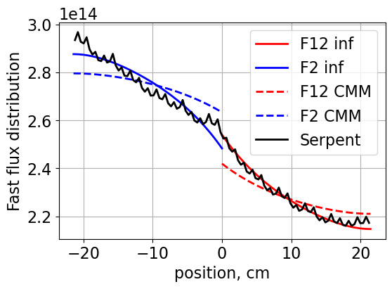

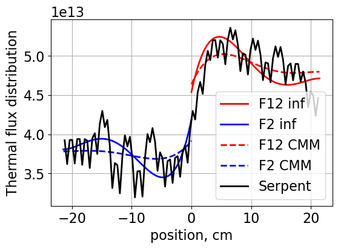

.. code:: ipython3

    # Plotting fast flux on right side
    plt.figure()
    Plot1d(xvals+10.71, flux_ref[0,:], xlabel="position, cm",
           ylabel='Flux distribution',
           fontsize=16, marker="-r", markersize=6)
    Plot1d(xvals-10.71, flux_f11[0,:], xlabel="position, cm",
           ylabel='Flux distribution',
           fontsize=16, marker="-b", markersize=6)

    Plot1d(xvals+10.71, flux_ref_cmm[0,:], xlabel="position, cm",
           ylabel='Flux distribution',
           fontsize=16, marker="--r", markersize=6)
    Plot1d(xvals-10.71, flux_f11_cmm[0,:], xlabel="position, cm",
           ylabel='Flux distribution',
           fontsize=16, marker="--b", markersize=6)

    Plot1d(xtally, fastHetFlux_x_top, xlabel="position, cm",
           ylabel='Fast flux distribution',
           fontsize=16, marker="-k", markersize=6)

    plt.legend(["Ref. inf", "F11 inf", "Ref CMM", "F11 CMM", "Serpent"])

    # Plotting thermal flux on right side
    plt.figure()
    Plot1d(xvals+10.71, flux_ref[1,:], xlabel="position, cm",
           ylabel='Flux distribution',
           fontsize=16, marker="-r", markersize=6)
    Plot1d(xvals-10.71, flux_f11[1,:], xlabel="position, cm",
           ylabel='Flux distribution',
           fontsize=16, marker="-b", markersize=6)

    Plot1d(xvals+10.71, flux_ref_cmm[1,:], xlabel="position, cm",
           ylabel='Flux distribution',
           fontsize=16, marker="--r", markersize=6)
    Plot1d(xvals-10.71, flux_f11_cmm[1,:], xlabel="position, cm",
           ylabel='Flux distribution',
           fontsize=16, marker="--b", markersize=6)

    Plot1d(xtally, thermalHetFlux_x_top, xlabel="position, cm",
           ylabel='Thermal flux distribution',
           fontsize=16, marker="-k", markersize=6)

    plt.legend(["Ref. inf", "F11 inf", "Ref CMM", "F11 CMM", "Serpent"])

.. parsed-literal::

    <matplotlib.legend.Legend at 0x7f78dcb57b30>

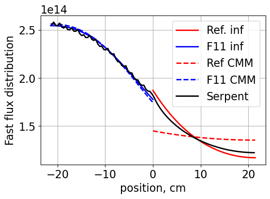

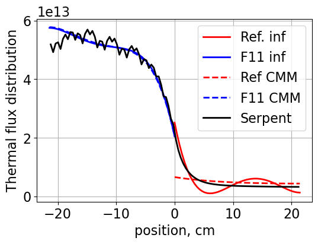

Question 3
----------

First lets test the implementation to make sure that it is correct.
'''''''''''''''''''''''''''''''''''''''''''''''''''''''''''''''''''

We have added a boolean to the input “symbolic=” to the input to indicate whether we use symbolic math or the analytical expression.
''''''''''''''''''''''''''''''''''''''''''''''''''''''''''''''''''''''''''''''''''''''''''''''''''''''''''''''''''''''''''''''''''''

.. code:: ipython3

    # TESTING TO MAKE SURE ANALYTICAL == SYMBOLIC REPRESENTATION - PLUG IN DX TO EACH EXPRESSION
    import sympy
    nem_f12_sym = CartesianNem1D(dx, dy, xs_f12, bc_f12, trLeakage_f12, 'y', symbolic=True)
    nem_f12_any = CartesianNem1D(dx, dy, xs_f12, bc_f12, trLeakage_f12, 'y', symbolic=False)

    print("hp")
    for this in [0,1,2,3,4]:
      print("\t"+str(this)+":",
            "SYMBOLIC:", nem_f12_sym.hp[this].subs(nem_f12_sym.x, dx),
            "ANALYTICAL:", (nem_f12_any.hp[this](dx)))

    print("hpp")
    for this in [0,1,2,3,4]:
      print("\t"+str(this)+":",
            "SYMBOLIC:", nem_f12_sym.hpp[this].subs(nem_f12_sym.x, dx),
            "ANALYTICAL:", (nem_f12_any.hpp[this](dx)))

    print("hint")
    for this in [0,1,2,3,4]:
      print("\t"+str(this)+":",
            "SYMBOLIC:", nem_f12_sym.hint[this].subs(nem_f12_sym.x, dx),
            "ANALYTICAL:", (nem_f12_any.hint[this](dx)))

    print("hh1int")
    for this in [0,1,2,3,4]:
      print("\t"+str(this)+":",
            "SYMBOLIC:", nem_f12_sym.hh1int[this].subs(nem_f12_sym.x, dx),
            "ANALYTICAL:", (nem_f12_any.hh1int[this](dx)))

    print("hh2int")
    for this in [0,1,2,3,4]:
      print("\t"+str(this)+":",
            "SYMBOLIC:", nem_f12_sym.hh2int[this].subs(nem_f12_sym.x, dx),
            "ANALYTICAL:", (nem_f12_any.hh2int[this](dx)))

    print("hpph1int")
    for this in [0,1,2,3,4]:
      print("\t"+str(this)+":",
            "SYMBOLIC:", nem_f12_sym.hpph1int[this].subs(nem_f12_sym.x, dx),
            "ANALYTICAL:", (nem_f12_any.hpph1int[this](dx)))

    print("hpph2int")
    for this in [0,1,2,3,4]:
      print("\t"+str(this)+":",
            "SYMBOLIC:", nem_f12_sym.hpph2int[this].subs(nem_f12_sym.x, dx),
            "ANALYTICAL:", (nem_f12_any.hpph2int[this](dx)))

.. _analytical_results_p4:

.. parsed-literal::

    hp
    	0: SYMBOLIC: 0 ANALYTICAL: 0
    	1: SYMBOLIC: 0.0466853408029879 ANALYTICAL: 0.046685340802987856
    	2: SYMBOLIC: 0.280112044817927 ANALYTICAL: 0.2801120448179271
    	3: SYMBOLIC: 0.128384687208217 ANALYTICAL: 0.1283846872082166
    	4: SYMBOLIC: 0.158730158730159 ANALYTICAL: 0.15873015873015872
    hpp
    	0: SYMBOLIC: 0 ANALYTICAL: 0
    	1: SYMBOLIC: 0 ANALYTICAL: 0
    	2: SYMBOLIC: 0.0130771262753467 ANALYTICAL: 0.013077126275346736
    	3: SYMBOLIC: 0.0130771262753467 ANALYTICAL: 0.013077126275346738
    	4: SYMBOLIC: 0.0248465399231588 ANALYTICAL: 0.024846539923158804
    hint
    	0: SYMBOLIC: 21.4200000000000 ANALYTICAL: 21.42
    	1: SYMBOLIC: 10.7100000000000 ANALYTICAL: 10.71
    	2: SYMBOLIC: 16.0650000000000 ANALYTICAL: 16.065
    	3: SYMBOLIC: 2.67750000000000 ANALYTICAL: 2.6775
    	4: SYMBOLIC: 2.40975000000000 ANALYTICAL: 2.40975
    hh1int
    	0: SYMBOLIC: 10.7100000000000 ANALYTICAL: 10.71
    	1: SYMBOLIC: 7.14000000000000 ANALYTICAL: 7.14
    	2: SYMBOLIC: 13.3875000000000 ANALYTICAL: 13.387500000000001
    	3: SYMBOLIC: 2.49900000000000 ANALYTICAL: 2.499
    	4: SYMBOLIC: 2.09737500000000 ANALYTICAL: 2.0973749999999995
    hh2int
    	0: SYMBOLIC: 16.0650000000000 ANALYTICAL: 16.065
    	1: SYMBOLIC: 13.3875000000000 ANALYTICAL: 13.387500000000001
    	2: SYMBOLIC: 29.1847500000000 ANALYTICAL: 29.184749999999998
    	3: SYMBOLIC: 6.02437500000000 ANALYTICAL: 6.024375
    	4: SYMBOLIC: 4.98971250000000 ANALYTICAL: 4.989703320000001
    hpph1int
    	0: SYMBOLIC: 0 ANALYTICAL: 0
    	1: SYMBOLIC: 0 ANALYTICAL: 0
    	2: SYMBOLIC: 0.140056022408964 ANALYTICAL: 0.14005602240896356
    	3: SYMBOLIC: 0.0933706816059757 ANALYTICAL: 0.09337068160597571
    	4: SYMBOLIC: 0.126050420168067 ANALYTICAL: 0.12605042016806725
    hpph2int
    	0: SYMBOLIC: 0 ANALYTICAL: 0
    	1: SYMBOLIC: 0 ANALYTICAL: 0
    	2: SYMBOLIC: 0.210084033613445 ANALYTICAL: 0.21008403361344535
    	3: SYMBOLIC: 0.175070028011204 ANALYTICAL: 0.17507002801120447
    	4: SYMBOLIC: 0.268440709617180 ANALYTICAL: 0.2684407096171802

All numbers match for every expression - we continue as is and set do_symbolic = False
''''''''''''''''''''''''''''''''''''''''''''''''''''''''''''''''''''''''''''''''''''''

.. _jupyter_analytical_r4:

.. code:: ipython3

    # Set whether to use symbolic or not...
    do_symbolic = False

    # Get fluxes in x and y direction on the top and the bottom
    fastHetFlux_x_bottom = det.detectors['flux_fast'].tallies[0:51, :].mean(axis=0)
    thermalHetFlux_x_bottom = det.detectors['flux_thermal'].tallies[0:51, :].mean(axis=0)

    fastHetFlux_y_left = det.detectors['flux_fast'].tallies[:, 0:51].mean(axis=1)
    thermalHetFlux_y_left = det.detectors['flux_thermal'].tallies[:, 0:51].mean(axis=1)

    fastHetFlux_x_top = det.detectors['flux_fast'].tallies[51:, :].mean(axis=0)
    thermalHetFlux_x_top = det.detectors['flux_thermal'].tallies[51:, :].mean(axis=0)

    fastHetFlux_y_right = det.detectors['flux_fast'].tallies[:, 51:].mean(axis=1)
    thermalHetFlux_y_right = det.detectors['flux_thermal'].tallies[:, 51:].mean(axis=1)

    # Get xs and BC for each node
    xs_f12, bc_f12 =  GetSerpentRes(resFile, 'F12', 0)
    xs_ref, bc_ref =  GetSerpentRes(resFile, 'Ref', 0)
    xs_f2, bc_f2 =  GetSerpentRes(resFile, 'F2', 0)
    xs_f11, bc_f11 =  GetSerpentRes(resFile, 'F11', 0)

    #########################################
    # Setup transverse leakages for each node
    #########################################

    # F12
    trLeakage_f12 = {}
    trLeakage_f12['eL'] = bc_ref['nJnet'] - bc_ref['sJnet']
    trLeakage_f12['eD'] = xs_ref['diff']
    trLeakage_f12['edx'] = dx

    trLeakage_f12['wL'] = bc_f12['nJnet'] - bc_f12['sJnet'] # use values from the node itself (since it is reflective ...)
    trLeakage_f12['wD'] = xs_f12['diff']
    trLeakage_f12['wdx'] = dx

    trLeakage_f12['nL'] = bc_f12['eJnet'] - bc_f12['wJnet']
    trLeakage_f12['nD'] = xs_f12['diff']
    trLeakage_f12['ndy'] = dy

    trLeakage_f12['sL'] = bc_f2['eJnet'] - bc_f2['wJnet']
    trLeakage_f12['sD'] = xs_f2['diff']
    trLeakage_f12['sdy'] = dy

    # F2
    trLeakage_f2 = {}
    trLeakage_f2['eL'] = bc_f11['nJnet'] - bc_f11['sJnet']
    trLeakage_f2['eD'] = xs_f11['diff']
    trLeakage_f2['edx'] = dx

    trLeakage_f2['wL'] = bc_f2['nJnet'] - bc_f2['sJnet'] # use values from the node itself (since it is reflective ...)
    trLeakage_f2['wD'] = xs_f2['diff']
    trLeakage_f2['wdx'] = dx

    trLeakage_f2['nL'] = bc_f12['eJnet'] - bc_f12['wJnet']
    trLeakage_f2['nD'] = xs_f12['diff']
    trLeakage_f2['ndy'] = dy

    trLeakage_f2['sL'] = bc_f2['eJnet'] - bc_f2['wJnet']
    trLeakage_f2['sD'] = xs_f2['diff']
    trLeakage_f2['sdy'] = dy

    # Ref
    trLeakage_ref = {}
    trLeakage_ref['eL'] = bc_ref['nJnet'] - bc_ref['sJnet']
    trLeakage_ref['eD'] = xs_ref['diff']
    trLeakage_ref['edx'] = dx

    trLeakage_ref['wL'] = bc_f12['nJnet'] - bc_f12['sJnet'] # use values from the node itself (since it is reflective ...)
    trLeakage_ref['wD'] = xs_f12['diff']
    trLeakage_ref['wdx'] = dx

    trLeakage_ref['nL'] = bc_ref['eJnet'] - bc_ref['wJnet']
    trLeakage_ref['nD'] = xs_ref['diff']
    trLeakage_ref['ndy'] = dy

    trLeakage_ref['sL'] = bc_f11['eJnet'] - bc_f11['wJnet']
    trLeakage_ref['sD'] = xs_f11['diff']
    trLeakage_ref['sdy'] = dy

    # F11
    trLeakage_f11 = {}
    trLeakage_f11['eL'] = bc_f11['nJnet'] - bc_f11['sJnet']
    trLeakage_f11['eD'] = xs_f11['diff']
    trLeakage_f11['edx'] = dx

    trLeakage_f11['wL'] = bc_f2['nJnet'] - bc_f2['sJnet'] # use values from the node itself (since it is reflective ...)
    trLeakage_f11['wD'] = xs_f2['diff']
    trLeakage_f11['wdx'] = dx

    trLeakage_f11['nL'] = bc_ref['eJnet'] - bc_ref['wJnet']
    trLeakage_f11['nD'] = xs_ref['diff']
    trLeakage_f11['ndy'] = dy

    trLeakage_f11['sL'] = bc_f11['eJnet'] - bc_f11['wJnet']
    trLeakage_f11['sD'] = xs_f11['diff']
    trLeakage_f11['sdy'] = dy

    start_time = time.time()

    # Solve for the F12
    nem_f12 = CartesianNem1D(dx, dy, xs_f12, bc_f12, trLeakage_f12, 'y', do_symbolic)
    nem_f12.TransverseLeakageCoef()  # obtain the coefficients of the TL
    nem_f12.GetExpansionCoeffs()

    nem_f2 = CartesianNem1D(dx, dy, xs_f2, bc_f2, trLeakage_f2, 'y', do_symbolic)
    nem_f2.TransverseLeakageCoef()  # obtain the coefficients of the TL
    nem_f2.GetExpansionCoeffs()

    nem_ref = CartesianNem1D(dx, dy, xs_ref, bc_ref, trLeakage_ref, 'y', do_symbolic)
    nem_ref.TransverseLeakageCoef()  # obtain the coefficients of the TL
    nem_ref.GetExpansionCoeffs()

    nem_f11 = CartesianNem1D(dx, dy, xs_f11, bc_f11, trLeakage_f11, 'y', do_symbolic)
    nem_f11.TransverseLeakageCoef()  # obtain the coefficients of the TL
    nem_f11.GetExpansionCoeffs()

    # get results
    xvals = np.linspace(-dx/2, +dx/2, 51)
    yvals = xvalss

    flux_f12_q3 = nem_f12.GetHomogFlux(yvals)
    flux_f2_q3 = nem_f2.GetHomogFlux(yvals)
    flux_ref_q3 = nem_ref.GetHomogFlux(yvals)
    flux_f11_q3 = nem_f11.GetHomogFlux(yvals)

    end_time = time.time()

    print("Total time =", end_time - start_time)

.. parsed-literal::

    SERPENT Serpent 2.2.1 found in ./serpent/SMR/SMR_Ref_2D_2g_res.m, but version 2.1.31 is defined in settings
      Attempting to read anyway. Please report strange behaviors/failures to developers.
    SERPENT Serpent 2.2.1 found in ./serpent/SMR/SMR_Ref_2D_2g_res.m, but version 2.1.31 is defined in settings
      Attempting to read anyway. Please report strange behaviors/failures to developers.
    SERPENT Serpent 2.2.1 found in ./serpent/SMR/SMR_Ref_2D_2g_res.m, but version 2.1.31 is defined in settings
      Attempting to read anyway. Please report strange behaviors/failures to developers.
    SERPENT Serpent 2.2.1 found in ./serpent/SMR/SMR_Ref_2D_2g_res.m, but version 2.1.31 is defined in settings
      Attempting to read anyway. Please report strange behaviors/failures to developers.

.. parsed-literal::

    Total time = 0.0016858577728271484

.. code:: ipython3

    # Plotting fast flux on left side
    plt.figure()
    Plot1d(xvals+10.71, flux_f12_q3[0,:], xlabel="position, cm",
           ylabel='Flux distribution',
           fontsize=16, marker="-r", markersize=6)
    Plot1d(xvals-10.71, flux_f2_q3[0,:], xlabel="position, cm",
           ylabel='Flux distribution',
           fontsize=16, marker="-b", markersize=6)
    Plot1d(xtally, fastHetFlux_x_bottom, xlabel="position, cm",
           ylabel='Fast flux distribution',
           fontsize=16, marker="-k", markersize=6)

    plt.legend(["F12", "F2", "Serpent"])

    # Plotting thermal flux on left side
    plt.figure()
    Plot1d(xvals+10.71, flux_f12_q3[1,:], xlabel="position, cm",
           ylabel='Flux distribution',
           fontsize=16, marker="-r", markersize=6)
    Plot1d(xvals-10.71, flux_f2_q3[1,:], xlabel="position, cm",
           ylabel='Flux distribution',
           fontsize=16, marker="-b", markersize=6)
    Plot1d(xtally, thermalHetFlux_y_left, xlabel="position, cm",
           ylabel='Thermal flux distribution',
           fontsize=16, marker="-k", markersize=6)
    plt.legend(["F12", "F2", "Serpent"])

.. parsed-literal::

    <matplotlib.legend.Legend at 0x7f78dcbb8260>

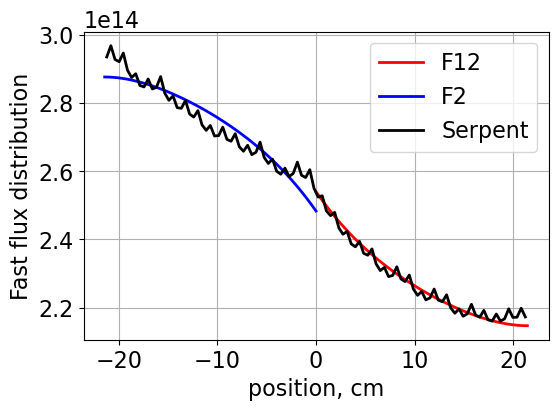

.. image:: ../homework4_files/homework4_30_2.png

