.. _project5_notebook:
NRE7203: Advanced Reactor Physics
=================================

Copyright (c) Dan Kotlyar

Under Copyright law, you do not have the right to provide these notes to
anyone else or to make any commercial use of them without express prior
permission from me.

.. code:: ipython3

    from IPython.display import Image
    import matplotlib.pyplot as plt
    from matplotlib import rcParams
    import numpy as np
    # Default values
    FONT_SIZE = 16  # font size for plotting purposes
    # rcParams['figure.dpi'] = 300
    plt.rcParams['figure.figsize'] = [6, 4] # Set default figure size

.. code:: ipython3

    from analytic_nodal_expansion import AFEN2D, meshPlot, GetSerpentRes, meshTo1D
    import serpentTools

Flux and pin-power reconstruction
=================================

Methodology
-----------

The methodology used in this workshop relies on **Lecture 11** and will
not be repeated here.

This workshop will include assignments/steps to guide through the
completetion of the code. Then, the code will be executed for a 2-dim
colorset case.

Complete the following sections in order:
~~~~~~~~~~~~~~~~~~~~~~~~~~~~~~~~~~~~~~~~~

1. Show the ``GetSerpentRes`` function
^^^^^^^^^^^^^^^^^^^^^^^^^^^^^^^^^^^^^^

- Updated with corner flux values.

2. Complete the auxiliary functions
^^^^^^^^^^^^^^^^^^^^^^^^^^^^^^^^^^^

- ``_basisFunctions``: Basis functions used for the expansion of the
  flux.
- ``_IntegrateX``: x integration over all the expansion functions
- ``_IntegrateY``: x integration over all the expansion functions
- ``_IntegrateXY``: x and y integration over all the expansion functions

**Use the above symbolic functions to complete**: - ``_CornerPoint``:
Evaluate the symbolic functions for specific x and y - ``_SurfaceX``:
Evaluate the average surface values for a surface at a specific x -
``_SurfaceY``: Evaluate the average surface values for a surface at a
specific y - ``_SurfaceXY``: Evaluate the node average

3. Complete ``_xsiBC``
^^^^^^^^^^^^^^^^^^^^^^

- create the RHS boundary conditions for :math:`\xi(x,y)` and the flux.

4. Complete ``Eigenvalues``
^^^^^^^^^^^^^^^^^^^^^^^^^^^

- A function that obtains the eigenvalues and eigenvectors.

5. Complete ``ReconstructFlux``
^^^^^^^^^^^^^^^^^^^^^^^^^^^^^^^

- Construct all the equations.

6. Complete ``GetFlux2D``
^^^^^^^^^^^^^^^^^^^^^^^^^

- Evaluate the homogeneous flux at specific :math:`x` and :math:`y`
  values.

7. Complete ``PinPower``
^^^^^^^^^^^^^^^^^^^^^^^^

- A function that reconstructs the power distribution.
- This will be part of your home assignment.

Colorset 2-dim test case
------------------------

.. code:: ipython3

    imgFile = './serpent/SMR/SMR_Ref_2D_2g_geom1.png'
    resFile = './serpent/SMR/SMR_Ref_2D_2g_res.m'
    detFile = './serpent/SMR/SMR_Ref_2D_2g_det0.m'

.. code:: ipython3

    Image(imgFile,  width=400, height=300)

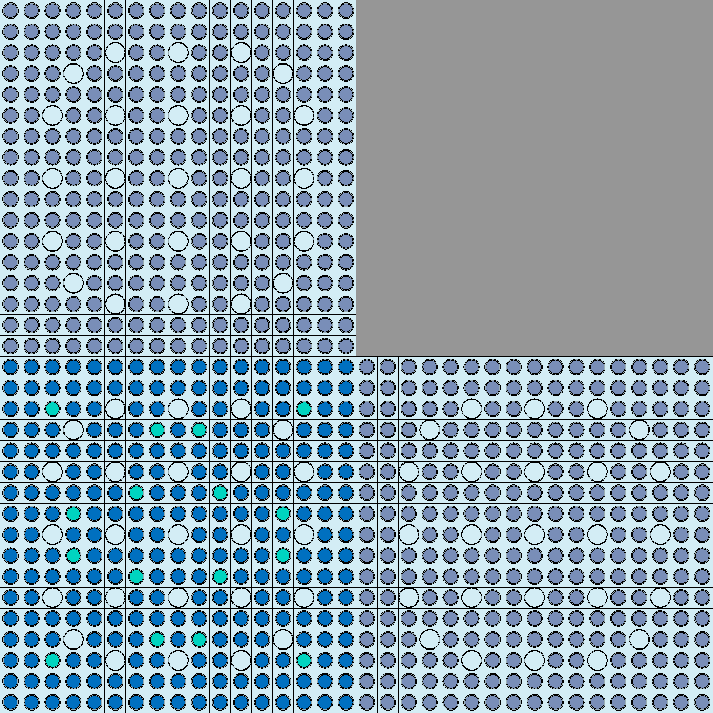

**Universes** within the colorset: - Upper left **F12** - 2.6%
UO\ :math:`_2` - Upper right **Ref** - stainless steel (with water for
PWR) - Bottom left **F2** - 4.55% UO\ :math:`_2` with 8%
Gd\ :math:`_2`\ O\ :math:`_3` - Bottom right **F11** - 2.6%
UO\ :math:`_2`

Read detector and results data from Serpent
^^^^^^^^^^^^^^^^^^^^^^^^^^^^^^^^^^^^^^^^^^^

.. code:: ipython3

    det = serpentTools.read(detFile)

.. code:: ipython3

    xsF2, bcF2 = GetSerpentRes(resFile, 'F2', 0)
    xsF11, bcF11 = GetSerpentRes(resFile, 'F11', 0)
    xsF12, bcF12 = GetSerpentRes(resFile, 'F12', 0)
    xsRef, bcRef = GetSerpentRes(resFile, 'Ref', 0)

.. parsed-literal::

    SERPENT Serpent 2.2.1 found in ./serpent/SMR/SMR_Ref_2D_2g_res.m, but version 2.1.31 is defined in settings
      Attempting to read anyway. Please report strange behaviors/failures to developers.
    SERPENT Serpent 2.2.1 found in ./serpent/SMR/SMR_Ref_2D_2g_res.m, but version 2.1.31 is defined in settings
      Attempting to read anyway. Please report strange behaviors/failures to developers.
    SERPENT Serpent 2.2.1 found in ./serpent/SMR/SMR_Ref_2D_2g_res.m, but version 2.1.31 is defined in settings
      Attempting to read anyway. Please report strange behaviors/failures to developers.
    SERPENT Serpent 2.2.1 found in ./serpent/SMR/SMR_Ref_2D_2g_res.m, but version 2.1.31 is defined in settings
      Attempting to read anyway. Please report strange behaviors/failures to developers.

Store cross sections and bc in dicts
^^^^^^^^^^^^^^^^^^^^^^^^^^^^^^^^^^^^

=== ===
F12 Ref
=== ===
F2  F11
=== ===

:math:`\;\;\;\;\;`\ N W\ :math:`\;\;\;\;\;\;`\ E :math:`\;\;\;\;\;`\ S

.. code:: ipython3

    radmap = [['F12', 'Ref'], ['F2', 'F11']]  # already doubled checked
    bc = {'F2': bcF2, 'F11': bcF11, 'F12': bcF12, 'Ref': bcRef,}
    xs = {'F2': xsF2, 'F11': xsF11, 'F12': xsF12, 'Ref': xsRef,}

.. code:: ipython3

    dx, dy = 21.42, 21.42  # cm  - assembly length
    npins = 17

Manipulate the data provided by Serpent (BC)
~~~~~~~~~~~~~~~~~~~~~~~~~~~~~~~~~~~~~~~~~~~~

Serpent already provodes the het flux values for all the surfaces and
corners for each universe.

.. code:: ipython3

    bcflux = {}
    for univ in bc:
        bcflux[univ] = {}
        # store the surface and corner fluxes
        bcflux[univ]['av'] = bc[univ]['flux']

        bcflux[univ]['w'] = bc[univ]['wFlux']
        bcflux[univ]['e'] = bc[univ]['eFlux']
        bcflux[univ]['s'] = bc[univ]['sFlux']
        bcflux[univ]['n'] = bc[univ]['nFlux']

        # Ignore these guys from serpent despite serpent giving us them (likely not very accurate since statistic problem from serpent)
        # bcflux[univ]['nw'] = bc[univ]['nwFlux']
        # bcflux[univ]['ne'] = bc[univ]['neFlux']
        # bcflux[univ]['sw'] = bc[univ]['swFlux']
        # bcflux[univ]['se'] = bc[univ]['seFlux']

        bcflux[univ]['nw'] = bcflux[univ]['n']+bcflux[univ]['w']-bcflux[univ]['av']
        bcflux[univ]['ne'] = bcflux[univ]['n']+bcflux[univ]['e']-bcflux[univ]['av']
        bcflux[univ]['sw'] = bcflux[univ]['s']+bcflux[univ]['w']-bcflux[univ]['av']
        bcflux[univ]['se'] = bcflux[univ]['s']+bcflux[univ]['e']-bcflux[univ]['av']

Manually average the corner fluxes using adjacent fuel assemblies
^^^^^^^^^^^^^^^^^^^^^^^^^^^^^^^^^^^^^^^^^^^^^^^^^^^^^^^^^^^^^^^^^

.. code:: ipython3

    bcflux['F12']['ne'] = (bcflux['F12']['ne'] + bcflux['Ref']['nw'])/2
    bcflux['Ref']['nw'] = bcflux['F12']['ne']

    bcflux['F12']['sw'] = (bcflux['F12']['sw'] + bcflux['F2']['nw'])/2
    bcflux['F2']['nw'] = bcflux['F12']['sw']

    bcflux['F2']['se'] = (bcflux['F2']['se'] + bcflux['F11']['sw'])/2
    bcflux['F11']['sw'] = bcflux['F2']['se']

    bcflux['F11']['ne'] = (bcflux['F11']['ne'] + bcflux['Ref']['se'])/2
    bcflux['Ref']['se'] = bcflux['F11']['ne']

    bcflux['F12']['se'] = (bcflux['F12']['se'] + bcflux['Ref']['sw']+
                           bcflux['F2']['ne'] + bcflux['F11']['nw'])/4
    bcflux['Ref']['sw'] = bcflux['F12']['se']
    bcflux['F2']['ne'] = bcflux['F12']['se']
    bcflux['F11']['nw'] = bcflux['F12']['se']

Reconstruct the homogeneous flux
^^^^^^^^^^^^^^^^^^^^^^^^^^^^^^^^

.. code:: ipython3

    univId = 'F11'  # user needs to choose

.. code:: ipython3

    univres = AFEN2D(xs[univId], bcflux[univId], dx, symbolic=True)
    univres.ReconstructFlux()  # a built-in method to obtain the coeffs

.. code:: ipython3

    univres.verifyBasisFunctions()

.. parsed-literal::

    BASIS FUNCTIONS
    Group 0 | key0 | ANY = 1.0 | SYM = 1.00000000000000 | Diff. = 0
    Group 0 | key1 | ANY = 5.1558738300831655 | SYM = 5.15587383008317 | Diff. = 0
    Group 0 | key2 | ANY = 5.251955345558114 | SYM = 5.25195534555811 | Diff. = 0
    Group 0 | key3 | ANY = 1.4580732741460756 | SYM = 1.45807327414608 | Diff. = 0
    Group 0 | key4 | ANY = 1.7680434589622103 | SYM = 1.76804345896221 | Diff. = 0
    Group 0 | key5 | ANY = 2.3385772645467684 | SYM = 2.33857726454677 | Diff. = 0
    Group 0 | key6 | ANY = 3.441519739973118 | SYM = 3.44151973997312 | Diff. = 0
    Group 0 | key7 | ANY = 2.515313444492246 | SYM = 2.51531344449225 | Diff. = 0
    Group 0 | key8 | ANY = 3.701609950064031 | SYM = 3.70160995006403 | Diff. = 0
    Group 1 | key0 | ANY = 1.0 | SYM = 1.00000000000000 | Diff. = 0
    Group 1 | key1 | ANY = 4485.935524514339 | SYM = 4485.93552451434 | Diff. = 0
    Group 1 | key2 | ANY = 4485.9356359738085 | SYM = 4485.93563597381 | Diff. = 0
    Group 1 | key3 | ANY = 47.35470217398589 | SYM = 47.3547021739859 | Diff. = 0
    Group 1 | key4 | ANY = 47.36525961067778 | SYM = 47.3652596106778 | Diff. = 0
    Group 1 | key5 | ANY = 3889.625804027583 | SYM = 3889.62580402758 | Diff. = 0
    Group 1 | key6 | ANY = 3902.1147010857094 | SYM = 3902.11470108571 | Diff. = 0
    Group 1 | key7 | ANY = 3889.645789671481 | SYM = 3889.64578967148 | Diff. = 0
    Group 1 | key8 | ANY = 3902.1347508999575 | SYM = 3902.13475089996 | Diff. = 0
    INTEGRAL X
    Group 0 | key0 | ANY = 20 | SYM = 20.0000000000000 | Diff. = 0
    Group 0 | key1 | ANY = 44.839484098657664 | SYM = 44.8394840986577 | Diff. = 7.10542735760100e-15
    Group 0 | key2 | ANY = 44.01917141474316 | SYM = 44.0191714147432 | Diff. = 7.10542735760100e-15
    Group 0 | key3 | ANY = 29.16146548292151 | SYM = 29.1614654829215 | Diff. = 0
    Group 0 | key4 | ANY = 35.360869179244204 | SYM = 35.3608691792442 | Diff. = 0
    Group 0 | key5 | ANY = 30.370132891672107 | SYM = 30.3701328916721 | Diff. = 0
    Group 0 | key6 | ANY = 44.693589318954125 | SYM = 44.6935893189541 | Diff. = 0
    Group 0 | key7 | ANY = 28.23620350666294 | SYM = 28.2362035066629 | Diff. = -3.55271367880050e-15
    Group 0 | key8 | ANY = 41.55323547495101 | SYM = 41.5532354749510 | Diff. = -7.10542735760100e-15
    Group 1 | key0 | ANY = 20 | SYM = 20.0000000000000 | Diff. = 0
    Group 1 | key1 | ANY = 9857.195767841471 | SYM = 9857.19576784147 | Diff. = 0
    Group 1 | key2 | ANY = 9857.195522925382 | SYM = 9857.19552292538 | Diff. = 0
    Group 1 | key3 | ANY = 947.0940434797178 | SYM = 947.094043479718 | Diff. = 0
    Group 1 | key4 | ANY = 947.3051922135556 | SYM = 947.305192213556 | Diff. = 0
    Group 1 | key5 | ANY = 12087.191305922875 | SYM = 12087.1913059229 | Diff. = -1.81898940354586e-12
    Group 1 | key6 | ANY = 12126.001128653186 | SYM = 12126.0011286532 | Diff. = -1.81898940354586e-12
    Group 1 | key7 | ANY = 12087.129199933222 | SYM = 12087.1291999332 | Diff. = -1.81898940354586e-12
    Group 1 | key8 | ANY = 12125.93882325224 | SYM = 12125.9388232522 | Diff. = -1.81898940354586e-12
    INTEGRAL Y
    Group 0 | key0 | ANY = 10 | SYM = 10.0000000000000 | Diff. = 0
    Group 0 | key1 | ANY = 51.558738300831656 | SYM = 51.5587383008317 | Diff. = 0
    Group 0 | key2 | ANY = 52.519553455581146 | SYM = 52.5195534555811 | Diff. = 0
    Group 0 | key3 | ANY = 15.09497917397982 | SYM = 15.0949791739798 | Diff. = 1.77635683940025e-15
    Group 0 | key4 | ANY = 12.448554698022278 | SYM = 12.4485546980223 | Diff. = 0
    Group 0 | key5 | ANY = 41.55323547495101 | SYM = 41.5532354749510 | Diff. = -7.10542735760100e-15
    Group 0 | key6 | ANY = 28.236203506662935 | SYM = 28.2362035066629 | Diff. = 0
    Group 0 | key7 | ANY = 44.693589318954125 | SYM = 44.6935893189541 | Diff. = 0
    Group 0 | key8 | ANY = 30.370132891672103 | SYM = 30.3701328916721 | Diff. = 3.55271367880050e-15
    Group 1 | key0 | ANY = 10 | SYM = 10.0000000000000 | Diff. = 0
    Group 1 | key1 | ANY = 44859.355245143386 | SYM = 44859.3552451434 | Diff. = 0
    Group 1 | key2 | ANY = 44859.356359738085 | SYM = 44859.3563597381 | Diff. = 0
    Group 1 | key3 | ANY = 104.07831820701843 | SYM = 104.078318207018 | Diff. = -1.42108547152020e-14
    Group 1 | key4 | ANY = 104.05511976443623 | SYM = 104.055119764436 | Diff. = 0
    Group 1 | key5 | ANY = 12125.93882325224 | SYM = 12125.9388232522 | Diff. = -1.81898940354586e-12
    Group 1 | key6 | ANY = 12087.129199933224 | SYM = 12087.1291999332 | Diff. = -3.63797880709171e-12
    Group 1 | key7 | ANY = 12126.001128653188 | SYM = 12126.0011286532 | Diff. = -3.63797880709171e-12
    Group 1 | key8 | ANY = 12087.191305922875 | SYM = 12087.1913059229 | Diff. = -1.81898940354586e-12
    INTEGRAL XY
    Group 0 | key0 | ANY = 800 | SYM = 800.000000000000 | Diff. = 0
    Group 0 | key1 | ANY = 0.0 | SYM = 0 | Diff. = 0
    Group 0 | key2 | ANY = 1760.7668565897266 | SYM = 1760.76685658973 | Diff. = 2.27373675443232e-13
    Group 0 | key3 | ANY = 0.0 | SYM = 0 | Diff. = 0
    Group 0 | key4 | ANY = 995.8843758417822 | SYM = 995.884375841782 | Diff. = 1.13686837721616e-13
    Group 0 | key5 | ANY = 0.0 | SYM = 0 | Diff. = 0
    Group 0 | key6 | ANY = 0.0 | SYM = 0 | Diff. = 0
    Group 0 | key7 | ANY = 0.0 | SYM = 0 | Diff. = 0
    Group 0 | key8 | ANY = 1363.7063877369098 | SYM = 1363.70638773691 | Diff. = -2.27373675443232e-13
    Group 1 | key0 | ANY = 800 | SYM = 800.000000000000 | Diff. = 0
    Group 1 | key1 | ANY = 0.0 | SYM = 0 | Diff. = 0
    Group 1 | key2 | ANY = 394287.82091701525 | SYM = 394287.820917015 | Diff. = 0
    Group 1 | key3 | ANY = 0.0 | SYM = 0 | Diff. = 0
    Group 1 | key4 | ANY = 8324.409581154898 | SYM = 8324.40958115490 | Diff. = 0
    Group 1 | key5 | ANY = 0.0 | SYM = 0 | Diff. = 0
    Group 1 | key6 | ANY = 0.0 | SYM = 0 | Diff. = 0
    Group 1 | key7 | ANY = 0.0 | SYM = 0 | Diff. = 0
    Group 1 | key8 | ANY = 150244.47045224538 | SYM = 150244.470452245 | Diff. = -2.91038304567337e-11

.. code:: ipython3

    yvals = np.linspace(-dx/2, +dx/2, npins+1)
    yvals = 0.5*(yvals[1:]+yvals[0:-1])
    univres.GetFlux2D(yvals, yvals)
    powerArrayMultipliers = np.array([
                    [1,1,1,1,1,1,1,1,1,1,1,1,1,1,1,1,1],
                    [1,1,1,1,1,1,1,1,1,1,1,1,1,1,1,1,1],
                    [1,1,1,1,1,0,1,1,0,1,1,0,1,1,1,1,1],
                    [1,1,1,0,1,1,1,1,1,1,1,1,1,0,1,1,1],
                    [1,1,1,1,1,1,1,1,1,1,1,1,1,1,1,1,1],
                    [1,1,0,1,1,0,1,1,0,1,1,0,1,1,0,1,1],
                    [1,1,1,1,1,1,1,1,1,1,1,1,1,1,1,1,1],
                    [1,1,1,1,1,1,1,1,1,1,1,1,1,1,1,1,1],
                    [1,1,0,1,1,0,1,1,0,1,1,0,1,1,0,1,1],
                    [1,1,1,1,1,1,1,1,1,1,1,1,1,1,1,1,1],
                    [1,1,1,1,1,1,1,1,1,1,1,1,1,1,1,1,1],
                    [1,1,0,1,1,0,1,1,0,1,1,0,1,1,0,1,1],
                    [1,1,1,1,1,1,1,1,1,1,1,1,1,1,1,1,1],
                    [1,1,1,0,1,1,1,1,1,1,1,1,1,0,1,1,1],
                    [1,1,1,1,1,0,1,1,0,1,1,0,1,1,1,1,1],
                    [1,1,1,1,1,1,1,1,1,1,1,1,1,1,1,1,1],
                    [1,1,1,1,1,1,1,1,1,1,1,1,1,1,1,1,1]])
    powerMap = univres.PinPower(arr_multipliers=powerArrayMultipliers)

Reference flux from Serpent
^^^^^^^^^^^^^^^^^^^^^^^^^^^

.. code:: ipython3

    fastHetFlux_f2 = det.detectors['flux_fast'].tallies[0:npins, 0:npins]
    thermalHetFlux_f2 = det.detectors['flux_thermal'].tallies[0:npins, 0:npins]
    fastPower_f2 = det.detectors['power_fast'].tallies[0:npins, 0:npins]
    thermalPower_f2 = det.detectors['power_thermal'].tallies[0:npins, 0:npins]
    serpentPower_f2 = fastPower_f2 + thermalPower_f2

    fastHetFlux_f11 = det.detectors['flux_fast'].tallies[0:npins, npins:]
    thermalHetFlux_f11 = det.detectors['flux_thermal'].tallies[0:npins, npins:]
    fastPower_f11 = det.detectors['power_fast'].tallies[0:npins, npins:]
    thermalPower_f11 = det.detectors['power_thermal'].tallies[0:npins, npins:]
    serpentPower_f11 = fastPower_f11 + thermalPower_f11

    fastHetFlux_f12 = det.detectors['flux_fast'].tallies[npins:, 0:npins]
    thermalHetFlux_f12 = det.detectors['flux_thermal'].tallies[npins:, 0:npins]
    fastPower_f12 = det.detectors['power_fast'].tallies[npins:, 0:npins]
    thermalPower_f12 = det.detectors['power_thermal'].tallies[npins:, 0:npins]
    serpentPower_f12 = fastPower_f12 + thermalPower_f12

    fastHetFlux_ref = det.detectors['flux_fast'].tallies[npins:, npins:]
    thermalHetFlux_ref = det.detectors['flux_thermal'].tallies[npins:, npins:]
    fastPower_ref = det.detectors['power_fast'].tallies[npins:, npins:]
    thermalPower_ref = det.detectors['power_thermal'].tallies[npins:, npins:]

Plot results
^^^^^^^^^^^^

1. **Fast** flux distribution
2. **Thermal** flux distribution

Fast Flux 2-dim
^^^^^^^^^^^^^^^

Question 1 - Comparing runtimes and analytical integrals
========================================================

.. code:: ipython3

    import time

.. code:: ipython3

    # F2 fluxes for symbolic and analytical implementations
    univ_f2_sym = AFEN2D(xs['F2'], bcflux['F2'], dx, symbolic=True)
    start = time.time()
    univ_f2_sym.ReconstructFlux()  # a built-in method to obtain the coeffs
    end = time.time()
    univ_f2_sym.GetFlux2D(yvals, yvals)
    sym_time = end-start
    print("Symbolic time =", sym_time)

    univ_f2_any = AFEN2D(xs['F2'], bcflux['F2'], dx, symbolic=False)
    start = time.time()
    univ_f2_any.ReconstructFlux()  # a built-in method to obtain the coeffs
    end = time.time()
    univ_f2_any.GetFlux2D(yvals, yvals)
    any_time = end-start
    print("Analytical time =", any_time)
    print("Ratio =", sym_time/any_time)

.. parsed-literal::

    Symbolic time = 0.33385777473449707
    Analytical time = 0.0004305839538574219
    Ratio = 775.3604651162791

.. code:: ipython3

    # Reflector fluxes for symbolic and analytical implementations
    univ_ref_sym = AFEN2D(xs['Ref'], bcflux['Ref'], dx, symbolic=True)
    start = time.time()
    univ_ref_sym.ReconstructFlux()  # a built-in method to obtain the coeffs
    end = time.time()
    univ_ref_sym.GetFlux2D(yvals, yvals)
    sym_time = end-start
    print("Symbolic time =", sym_time)

    univ_ref_any = AFEN2D(xs['Ref'], bcflux['Ref'], dx, symbolic=False)
    start = time.time()
    univ_ref_any.ReconstructFlux()  # a built-in method to obtain the coeffs
    end = time.time()
    univ_ref_any.GetFlux2D(yvals, yvals)
    any_time = end-start
    print("Analytical time =", any_time)
    print("Ratio =", sym_time/any_time)

.. parsed-literal::

    Symbolic time = 0.3795440196990967
    Analytical time = 0.0005919933319091797
    Ratio = 641.1288763592429

.. code:: ipython3

    # Fast fluxes Reflector
    meshPlot(univ_ref_sym.flux2d[0], 17, cbar_label='Flux (1/cm2-s)', xlabel='X (cm)', ylabel='Y (cm)', fontsize=15)
    meshPlot(univ_ref_any.flux2d[0], 17, cbar_label='Flux (1/cm2-s)', xlabel='X (cm)', ylabel='Y (cm)', fontsize=15)

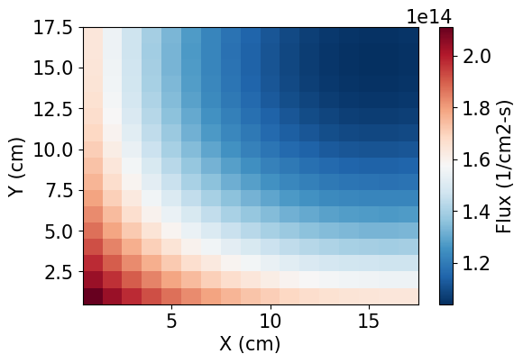

.. image:: homework5_files/homework5_46_1.png

.. code:: ipython3

    # Fast fluxes F2
    meshPlot(univ_f2_sym.flux2d[0], 17, cbar_label='Flux (1/cm2-s)', xlabel='X (cm)', ylabel='Y (cm)', fontsize=15)
    meshPlot(univ_f2_any.flux2d[0], 17, cbar_label='Flux (1/cm2-s)', xlabel='X (cm)', ylabel='Y (cm)', fontsize=15)

.. image:: homework5_files/homework5_47_0.png

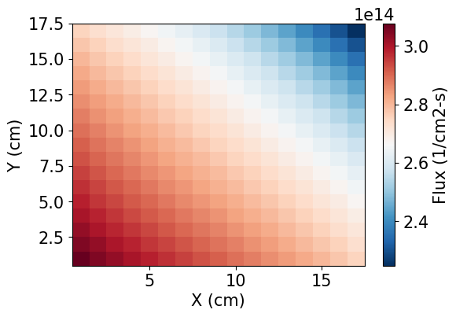

.. code:: ipython3

    # Theraml fluxes Reflector
    meshPlot(univ_ref_sym.flux2d[1], 17, cbar_label='Flux (1/cm2-s)', xlabel='X (cm)', ylabel='Y (cm)', fontsize=15)
    meshPlot(univ_ref_any.flux2d[1], 17, cbar_label='Flux (1/cm2-s)', xlabel='X (cm)', ylabel='Y (cm)', fontsize=15)

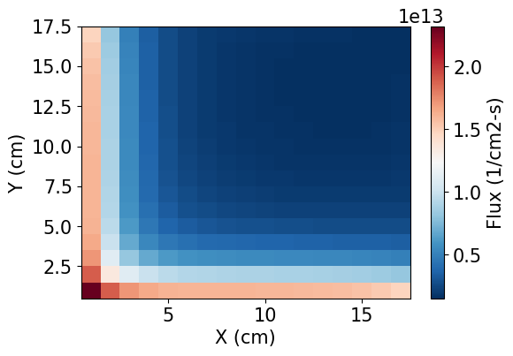

.. image:: homework5_files/homework5_48_1.png

.. code:: ipython3

    # Thermal fluxes F2
    meshPlot(univ_f2_sym.flux2d[1], 17, cbar_label='Flux (1/cm2-s)', xlabel='X (cm)', ylabel='Y (cm)', fontsize=15)
    meshPlot(univ_f2_any.flux2d[1], 17, cbar_label='Flux (1/cm2-s)', xlabel='X (cm)', ylabel='Y (cm)', fontsize=15)

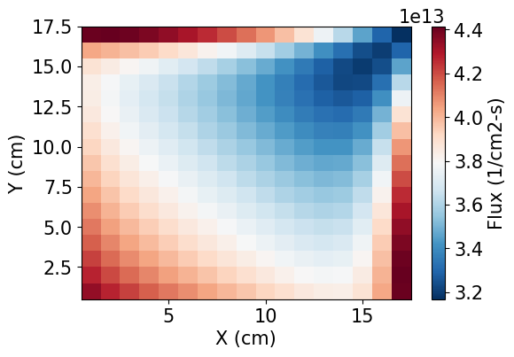

.. image:: homework5_files/homework5_49_1.png

.. code:: ipython3

    univ_f2_any.verifyBasisFunctions()

.. _proj5_notebook_results_basis_functions:

.. parsed-literal::

    BASIS FUNCTIONS
    Group 0 | key0 | ANY = 1.0 | SYM = 1.00000000000000 | Diff. = 0
    Group 0 | key1 | ANY = 4.4727091661101355 | SYM = 4.47270916611014 | Diff. = 0
    Group 0 | key2 | ANY = 4.583135093427383 | SYM = 4.58313509342738 | Diff. = 0
    Group 0 | key3 | ANY = 1.3384945075396057 | SYM = 1.33849450753961 | Diff. = 0
    Group 0 | key4 | ANY = 1.6707984757934429 | SYM = 1.67079847579344 | Diff. = 0
    Group 0 | key5 | ANY = 1.9523183842663476 | SYM = 1.95231838426635 | Diff. = 0
    Group 0 | key6 | ANY = 2.9936844294890133 | SYM = 2.99368442948901 | Diff. = 0
    Group 0 | key7 | ANY = 2.133440220198767 | SYM = 2.13344022019877 | Diff. = 0
    Group 0 | key8 | ANY = 3.271416598811952 | SYM = 3.27141659881195 | Diff. = 0
    Group 1 | key0 | ANY = 1.0 | SYM = 1.00000000000000 | Diff. = 0
    Group 1 | key1 | ANY = 51451.86186476845 | SYM = 51451.8618647684 | Diff. = 0
    Group 1 | key2 | ANY = 51451.86187448627 | SYM = 51451.8618744863 | Diff. = 0
    Group 1 | key3 | ANY = 160.39149272091439 | SYM = 160.391492720914 | Diff. = 0
    Group 1 | key4 | ANY = 160.39461006294175 | SYM = 160.394610062942 | Diff. = 0
    Group 1 | key5 | ANY = 51796.68506438178 | SYM = 51796.6850643818 | Diff. = 0
    Group 1 | key6 | ANY = 51826.27417940889 | SYM = 51826.2741794089 | Diff. = 0
    Group 1 | key7 | ANY = 51796.69351102147 | SYM = 51796.6935110215 | Diff. = 0
    Group 1 | key8 | ANY = 51826.28263087376 | SYM = 51826.2826308738 | Diff. = 0
    INTEGRAL X
    Group 0 | key0 | ANY = 20 | SYM = 20.0000000000000 | Diff. = 0
    Group 0 | key1 | ANY = 41.6003777768816 | SYM = 41.6003777768816 | Diff. = 0
    Group 0 | key2 | ANY = 40.59805945129966 | SYM = 40.5980594512997 | Diff. = 0
    Group 0 | key3 | ANY = 26.769890150792115 | SYM = 26.7698901507921 | Diff. = 0
    Group 0 | key4 | ANY = 33.41596951586886 | SYM = 33.4159695158689 | Diff. = 0
    Group 0 | key5 | ANY = 27.386093831869722 | SYM = 27.3860938318697 | Diff. = 0
    Group 0 | key6 | ANY = 41.99382813259855 | SYM = 41.9938281325986 | Diff. = 0
    Group 0 | key7 | ANY = 25.061107386557648 | SYM = 25.0611073865576 | Diff. = 0
    Group 0 | key8 | ANY = 38.42869460919563 | SYM = 38.4286946091956 | Diff. = 0
    Group 1 | key0 | ANY = 20 | SYM = 20.0000000000000 | Diff. = 0
    Group 1 | key1 | ANY = 89159.3691420088 | SYM = 89159.3691420088 | Diff. = 0
    Group 1 | key2 | ANY = 89159.36912516909 | SYM = 89159.3691251691 | Diff. = -1.45519152283669e-11
    Group 1 | key3 | ANY = 3207.8298544182876 | SYM = 3207.82985441829 | Diff. = 0
    Group 1 | key4 | ANY = 3207.892201258835 | SYM = 3207.89220125884 | Diff. = 0
    Group 1 | key5 | ANY = 126935.44992422638 | SYM = 126935.449924226 | Diff. = 0
    Group 1 | key6 | ANY = 127007.96243393926 | SYM = 127007.962433939 | Diff. = 0
    Group 1 | key7 | ANY = 126935.42922448792 | SYM = 126935.429224488 | Diff. = 0
    Group 1 | key8 | ANY = 127007.94172237597 | SYM = 127007.941722376 | Diff. = 0
    INTEGRAL Y
    Group 0 | key0 | ANY = 10 | SYM = 10.0000000000000 | Diff. = 0
    Group 0 | key1 | ANY = 44.727091661101355 | SYM = 44.7270916611014 | Diff. = 0
    Group 0 | key2 | ANY = 45.83135093427383 | SYM = 45.8313509342738 | Diff. = 0
    Group 0 | key3 | ANY = 15.165568189714213 | SYM = 15.1655681897142 | Diff. = 0
    Group 0 | key4 | ANY = 12.149298685474358 | SYM = 12.1492986854744 | Diff. = 0
    Group 0 | key5 | ANY = 38.42869460919563 | SYM = 38.4286946091956 | Diff. = 0
    Group 0 | key6 | ANY = 25.061107386557644 | SYM = 25.0611073865576 | Diff. = 3.55271367880050e-15
    Group 0 | key7 | ANY = 41.99382813259855 | SYM = 41.9938281325986 | Diff. = 0
    Group 0 | key8 | ANY = 27.386093831869722 | SYM = 27.3860938318697 | Diff. = 0
    Group 1 | key0 | ANY = 10 | SYM = 10.0000000000000 | Diff. = 0
    Group 1 | key1 | ANY = 514518.61864768446 | SYM = 514518.618647684 | Diff. = 0
    Group 1 | key2 | ANY = 514518.6187448627 | SYM = 514518.618744863 | Diff. = 0
    Group 1 | key3 | ANY = 277.94294950639573 | SYM = 277.942949506396 | Diff. = -5.68434188608080e-14
    Group 1 | key4 | ANY = 277.9375475590524 | SYM = 277.937547559052 | Diff. = 0
    Group 1 | key5 | ANY = 127007.94172237597 | SYM = 127007.941722376 | Diff. = 0
    Group 1 | key6 | ANY = 126935.42922448792 | SYM = 126935.429224488 | Diff. = 0
    Group 1 | key7 | ANY = 127007.96243393925 | SYM = 127007.962433939 | Diff. = 1.45519152283669e-11
    Group 1 | key8 | ANY = 126935.44992422638 | SYM = 126935.449924226 | Diff. = 0
    INTEGRAL XY
    Group 0 | key0 | ANY = 800 | SYM = 800.000000000000 | Diff. = 0
    Group 0 | key1 | ANY = 0.0 | SYM = 0 | Diff. = 0
    Group 0 | key2 | ANY = 1623.9223780519865 | SYM = 1623.92237805199 | Diff. = 0
    Group 0 | key3 | ANY = 0.0 | SYM = 0 | Diff. = 0
    Group 0 | key4 | ANY = 971.9438948379486 | SYM = 971.943894837949 | Diff. = 0
    Group 0 | key5 | ANY = 0.0 | SYM = 0 | Diff. = 0
    Group 0 | key6 | ANY = 0.0 | SYM = 0 | Diff. = 0
    Group 0 | key7 | ANY = 0.0 | SYM = 0 | Diff. = 0
    Group 0 | key8 | ANY = 1286.796474390809 | SYM = 1286.79647439081 | Diff. = 2.27373675443232e-13
    Group 1 | key0 | ANY = 800 | SYM = 800.000000000000 | Diff. = 0
    Group 1 | key1 | ANY = 0.0 | SYM = 0 | Diff. = 0
    Group 1 | key2 | ANY = 3566374.765006764 | SYM = 3566374.76500676 | Diff. = -9.31322574615479e-10
    Group 1 | key3 | ANY = 0.0 | SYM = 0 | Diff. = 0
    Group 1 | key4 | ANY = 22235.00380472419 | SYM = 22235.0038047242 | Diff. = 3.63797880709171e-12
    Group 1 | key5 | ANY = 0.0 | SYM = 0 | Diff. = 0
    Group 1 | key6 | ANY = 0.0 | SYM = 0 | Diff. = 0
    Group 1 | key7 | ANY = 0.0 | SYM = 0 | Diff. = 0
    Group 1 | key8 | ANY = 1244296.0913330636 | SYM = 1244296.09133306 | Diff. = 2.32830643653870e-10

Question 2. Reproducing power
=============================

.. code:: ipython3

    # Copy results we currently own
    univ_f2 = univ_f2_sym
    univ_ref = univ_ref_sym

    # Solve F11
    univ_f11 = AFEN2D(xs['F11'], bcflux['F11'], dx, symbolic=True)
    univ_f11.ReconstructFlux()  # a built-in method to obtain the coeffs
    univ_f11.GetFlux2D(yvals, yvals)

    # Solve F12
    univ_f12 = AFEN2D(xs['F12'], bcflux['F12'], dx, symbolic=True)
    univ_f12.ReconstructFlux()  # a built-in method to obtain the coeffs
    univ_f12.GetFlux2D(yvals, yvals)

    # Get power for each
    power_f11 = univ_f11.PinPower(arr_multipliers=powerArrayMultipliers)
    power_f12 = univ_f12.PinPower(arr_multipliers=powerArrayMultipliers)
    power_f2 = univ_f2.PinPower(arr_multipliers=powerArrayMultipliers)

.. code:: ipython3

    # Plotting F11 power
    meshPlot(power_f11, 17, cbar_label='Power (W/cm3)', xlabel='X (cm)', ylabel='Y (cm)', fontsize=15)
    meshPlot(serpentPower_f11, 17, cbar_label='Power (W/cm3)', xlabel='X (cm)', ylabel='Y (cm)', fontsize=15)
    meshPlot((serpentPower_f11-power_f11)/serpentPower_f11*-100, npins=17, cbar_label='% Diff.', xlabel='X (cm)', ylabel='Y (cm)', fontsize=15)

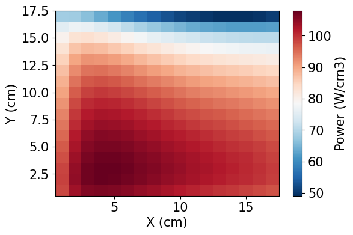

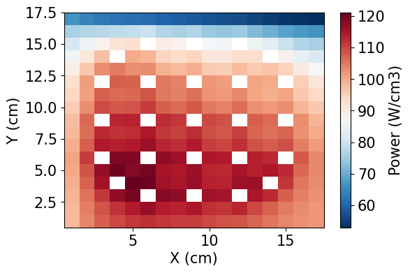

.. parsed-literal::

    /tmp/ipykernel_43380/3419674678.py:4: RuntimeWarning: divide by zero encountered in divide
      meshPlot((serpentPower_f11-power_f11)/serpentPower_f11*-100, npins=17, cbar_label='% Diff.', xlabel='X (cm)', ylabel='Y (cm)', fontsize=15)

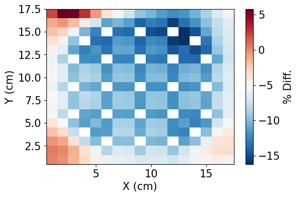

.. code:: ipython3

    # Plotting F12 power
    meshPlot(power_f12, 17, cbar_label='Power (W/cm3)', xlabel='X (cm)', ylabel='Y (cm)', fontsize=15)
    meshPlot(serpentPower_f12, 17, cbar_label='Power (W/cm3)', xlabel='X (cm)', ylabel='Y (cm)', fontsize=15)
    meshPlot((serpentPower_f12-power_f12)/serpentPower_f12*-100, npins=17, cbar_label='% Diff.', xlabel='X (cm)', ylabel='Y (cm)', fontsize=15)

.. image:: homework5_files/homework5_54_0.png

.. image:: homework5_files/homework5_54_1.png

.. parsed-literal::

    /tmp/ipykernel_43380/2895767898.py:4: RuntimeWarning: divide by zero encountered in divide
      meshPlot((serpentPower_f12-power_f12)/serpentPower_f12*-100, npins=17, cbar_label='% Diff.', xlabel='X (cm)', ylabel='Y (cm)', fontsize=15)

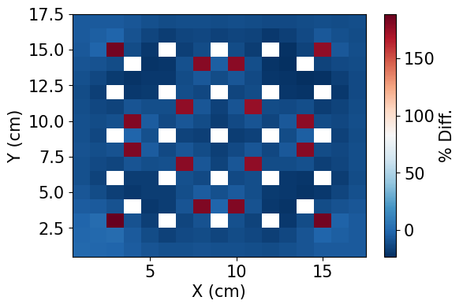

.. code:: ipython3

    # Plotting F2 power
    meshPlot(power_f2, 17, cbar_label='Power (W/cm3)', xlabel='X (cm)', ylabel='Y (cm)', fontsize=15)
    meshPlot(serpentPower_f2, 17, cbar_label='Power (W/cm3)', xlabel='X (cm)', ylabel='Y (cm)', fontsize=15)
    meshPlot((serpentPower_f2-power_f2)/serpentPower_f2*-100, npins=17, cbar_label='% Diff.', xlabel='X (cm)', ylabel='Y (cm)', fontsize=15)

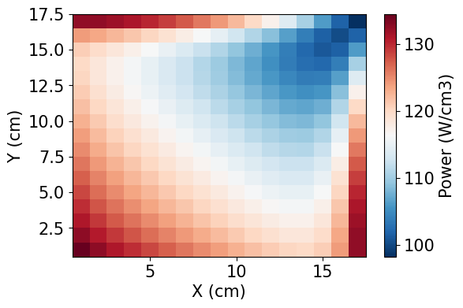

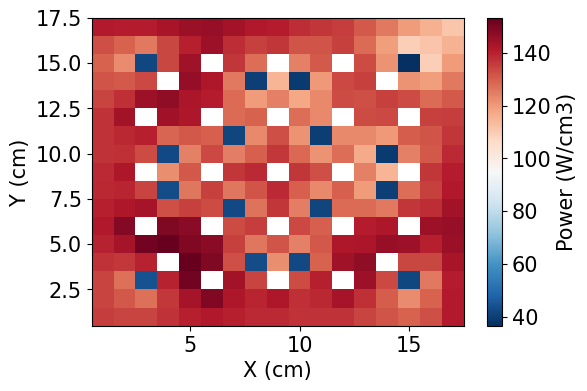

.. parsed-literal::

    /tmp/ipykernel_43380/487733789.py:4: RuntimeWarning: divide by zero encountered in divide
      meshPlot((serpentPower_f2-power_f2)/serpentPower_f2*-100, npins=17, cbar_label='% Diff.', xlabel='X (cm)', ylabel='Y (cm)', fontsize=15)

.. image:: homework5_files/homework5_55_3.png

.. code:: ipython3

    # Plotting AFEN solvers
    fig, axs = plt.subplots(2,2)
    meshPlot(power_f12, 17, fontsize=6, ax=axs[0][0])
    meshPlot(power_f2, 17, fontsize=6, ax=axs[1][0])
    meshPlot(power_f11, 17, fontsize=6, ax=axs[1][1])
    axs[0,1].remove()

    fig, axs = plt.subplots(2,2)
    meshPlot(serpentPower_f12, 17, fontsize=6, ax=axs[0][0])
    meshPlot(serpentPower_f2, 17, fontsize=6, ax=axs[1][0])
    meshPlot(serpentPower_f11, 17, fontsize=6, ax=axs[1][1])
    axs[0,1].remove()

    fig, axs = plt.subplots(2,2)
    meshPlot((serpentPower_f12-power_f12)/serpentPower_f12*-100, 17, fontsize=6, ax=axs[0][0])
    meshPlot((serpentPower_f2-power_f2)/serpentPower_f2*-100, 17, fontsize=6, ax=axs[1][0])
    meshPlot((serpentPower_f11-power_f11)/serpentPower_f11*-100, 17, fontsize=6, ax=axs[1][1])
    axs[0,1].remove()

.. parsed-literal::

    /tmp/ipykernel_43380/3063172959.py:16: RuntimeWarning: divide by zero encountered in divide
      meshPlot((serpentPower_f12-power_f12)/serpentPower_f12*-100, 17, fontsize=6, ax=axs[0][0])
    /tmp/ipykernel_43380/3063172959.py:17: RuntimeWarning: divide by zero encountered in divide
      meshPlot((serpentPower_f2-power_f2)/serpentPower_f2*-100, 17, fontsize=6, ax=axs[1][0])
    /tmp/ipykernel_43380/3063172959.py:18: RuntimeWarning: divide by zero encountered in divide
      meshPlot((serpentPower_f11-power_f11)/serpentPower_f11*-100, 17, fontsize=6, ax=axs[1][1])

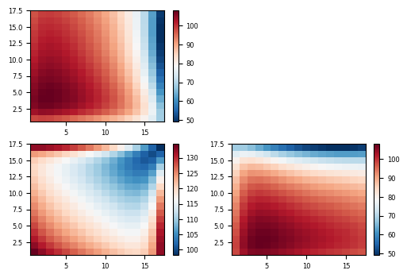

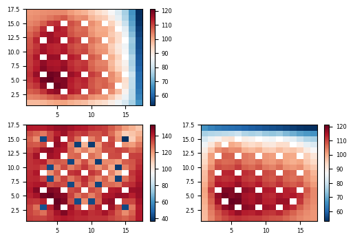

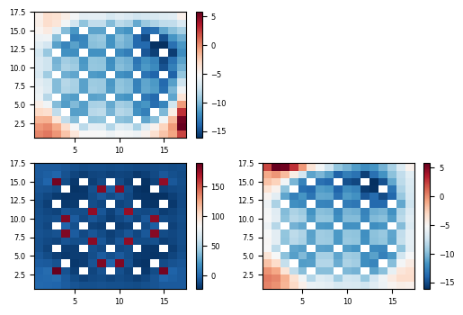

Question 3. 1D fluxes and powers
================================

.. code:: ipython3

    # First do NEM method:
    from NEM import CartesianNem1D, GetSerpentRes, Plot1d, Plot2d

    # Get fluxes in x and y direction on the top and the bottom
    fastHetFlux_x_bottom = det.detectors['flux_fast'].tallies[0:51, :].mean(axis=0)
    thermalHetFlux_x_bottom = det.detectors['flux_thermal'].tallies[0:51, :].mean(axis=0)

    fastHetFlux_y_left = det.detectors['flux_fast'].tallies[:, 0:51].mean(axis=1)
    thermalHetFlux_y_left = det.detectors['flux_thermal'].tallies[:, 0:51].mean(axis=1)

    fastHetFlux_x_top = det.detectors['flux_fast'].tallies[51:, :].mean(axis=0)
    thermalHetFlux_x_top = det.detectors['flux_thermal'].tallies[51:, :].mean(axis=0)

    fastHetFlux_y_right = det.detectors['flux_fast'].tallies[:, 51:].mean(axis=1)
    thermalHetFlux_y_right = det.detectors['flux_thermal'].tallies[:, 51:].mean(axis=1)

    # Get xs and BC for each node
    xs_f12, bc_f12 =  GetSerpentRes(resFile, 'F12', 0)
    xs_ref, bc_ref =  GetSerpentRes(resFile, 'Ref', 0)
    xs_f2, bc_f2 =  GetSerpentRes(resFile, 'F2', 0)
    xs_f11, bc_f11 =  GetSerpentRes(resFile, 'F11', 0)

    #########################################
    # Setup transverse leakages for each node
    #########################################

    # F12
    trLeakage_f12 = {}
    trLeakage_f12['eL'] = bc_ref['nJnet'] - bc_ref['sJnet']
    trLeakage_f12['eD'] = xs_ref['diff']
    trLeakage_f12['edx'] = dx

    trLeakage_f12['wL'] = bc_f12['nJnet'] - bc_f12['sJnet'] # use values from the node itself (since it is reflective ...)
    trLeakage_f12['wD'] = xs_f12['diff']
    trLeakage_f12['wdx'] = dx

    trLeakage_f12['nL'] = bc_f12['eJnet'] - bc_f12['wJnet']
    trLeakage_f12['nD'] = xs_f12['diff']
    trLeakage_f12['ndy'] = dy

    trLeakage_f12['sL'] = bc_f2['eJnet'] - bc_f2['wJnet']
    trLeakage_f12['sD'] = xs_f2['diff']
    trLeakage_f12['sdy'] = dy

    # F2
    trLeakage_f2 = {}
    trLeakage_f2['eL'] = bc_f11['nJnet'] - bc_f11['sJnet']
    trLeakage_f2['eD'] = xs_f11['diff']
    trLeakage_f2['edx'] = dx

    trLeakage_f2['wL'] = bc_f2['nJnet'] - bc_f2['sJnet'] # use values from the node itself (since it is reflective ...)
    trLeakage_f2['wD'] = xs_f2['diff']
    trLeakage_f2['wdx'] = dx

    trLeakage_f2['nL'] = bc_f12['eJnet'] - bc_f12['wJnet']
    trLeakage_f2['nD'] = xs_f12['diff']
    trLeakage_f2['ndy'] = dy

    trLeakage_f2['sL'] = bc_f2['eJnet'] - bc_f2['wJnet']
    trLeakage_f2['sD'] = xs_f2['diff']
    trLeakage_f2['sdy'] = dy

    # Ref
    trLeakage_ref = {}
    trLeakage_ref['eL'] = bc_ref['nJnet'] - bc_ref['sJnet']
    trLeakage_ref['eD'] = xs_ref['diff']
    trLeakage_ref['edx'] = dx

    trLeakage_ref['wL'] = bc_f12['nJnet'] - bc_f12['sJnet'] # use values from the node itself (since it is reflective ...)
    trLeakage_ref['wD'] = xs_f12['diff']
    trLeakage_ref['wdx'] = dx

    trLeakage_ref['nL'] = bc_ref['eJnet'] - bc_ref['wJnet']
    trLeakage_ref['nD'] = xs_ref['diff']
    trLeakage_ref['ndy'] = dy

    trLeakage_ref['sL'] = bc_f11['eJnet'] - bc_f11['wJnet']
    trLeakage_ref['sD'] = xs_f11['diff']
    trLeakage_ref['sdy'] = dy

    # F11
    trLeakage_f11 = {}
    trLeakage_f11['eL'] = bc_f11['nJnet'] - bc_f11['sJnet']
    trLeakage_f11['eD'] = xs_f11['diff']
    trLeakage_f11['edx'] = dx

    trLeakage_f11['wL'] = bc_f2['nJnet'] - bc_f2['sJnet'] # use values from the node itself (since it is reflective ...)
    trLeakage_f11['wD'] = xs_f2['diff']
    trLeakage_f11['wdx'] = dx

    trLeakage_f11['nL'] = bc_ref['eJnet'] - bc_ref['wJnet']
    trLeakage_f11['nD'] = xs_ref['diff']
    trLeakage_f11['ndy'] = dy

    trLeakage_f11['sL'] = bc_f11['eJnet'] - bc_f11['wJnet']
    trLeakage_f11['sD'] = xs_f11['diff']
    trLeakage_f11['sdy'] = dy

    start_time = time.time()

    # Solve for the F12
    nem_f12 = CartesianNem1D(dx, dy, xs_f12, bc_f12, trLeakage_f12, 'x')
    nem_f12.TransverseLeakageCoef()  # obtain the coefficients of the TL
    nem_f12.GetExpansionCoeffs()

    nem_f2 = CartesianNem1D(dx, dy, xs_f2, bc_f2, trLeakage_f2, 'x')
    nem_f2.TransverseLeakageCoef()  # obtain the coefficients of the TL
    nem_f2.GetExpansionCoeffs()

    nem_ref = CartesianNem1D(dx, dy, xs_ref, bc_ref, trLeakage_ref, 'x')
    nem_ref.TransverseLeakageCoef()  # obtain the coefficients of the TL
    nem_ref.GetExpansionCoeffs()

    nem_f11 = CartesianNem1D(dx, dy, xs_f11, bc_f11, trLeakage_f11, 'x')
    nem_f11.TransverseLeakageCoef()  # obtain the coefficients of the TL
    nem_f11.GetExpansionCoeffs()

    # get results
    xvals_nem = np.linspace(-dx/2, +dx/2, 51)
    yvals_nem = xvals_nem

    flux_f12 = nem_f12.GetHomogFlux(yvals_nem)
    flux_f2 = nem_f2.GetHomogFlux(yvals_nem)
    flux_ref = nem_ref.GetHomogFlux(yvals_nem)
    flux_f11 = nem_f11.GetHomogFlux(yvals_nem)

    end_time = time.time()

    print("Total time =", end_time - start_time)

    power_f12_nem = nem_f12.Power1D(yvals_nem)
    power_f11_nem = nem_f11.Power1D(yvals_nem)
    power_f2_nem = nem_f2.Power1D(yvals_nem)
    power_ref_nem = nem_ref.Power1D(yvals_nem)

.. parsed-literal::

    /tmp/ipykernel_43380/1156505218.py:11: RuntimeWarning: Mean of empty slice.
      fastHetFlux_x_top = det.detectors['flux_fast'].tallies[51:, :].mean(axis=0)
    /home/jonathon/miniconda3/envs/openmc-env/lib/python3.12/site-packages/numpy/_core/_methods.py:137: RuntimeWarning: invalid value encountered in divide
      ret = um.true_divide(
    /tmp/ipykernel_43380/1156505218.py:12: RuntimeWarning: Mean of empty slice.
      thermalHetFlux_x_top = det.detectors['flux_thermal'].tallies[51:, :].mean(axis=0)
    /tmp/ipykernel_43380/1156505218.py:14: RuntimeWarning: Mean of empty slice.
      fastHetFlux_y_right = det.detectors['flux_fast'].tallies[:, 51:].mean(axis=1)
    /tmp/ipykernel_43380/1156505218.py:15: RuntimeWarning: Mean of empty slice.
      thermalHetFlux_y_right = det.detectors['flux_thermal'].tallies[:, 51:].mean(axis=1)
    SERPENT Serpent 2.2.1 found in ./serpent/SMR/SMR_Ref_2D_2g_res.m, but version 2.1.31 is defined in settings
      Attempting to read anyway. Please report strange behaviors/failures to developers.
    SERPENT Serpent 2.2.1 found in ./serpent/SMR/SMR_Ref_2D_2g_res.m, but version 2.1.31 is defined in settings
      Attempting to read anyway. Please report strange behaviors/failures to developers.
    SERPENT Serpent 2.2.1 found in ./serpent/SMR/SMR_Ref_2D_2g_res.m, but version 2.1.31 is defined in settings
      Attempting to read anyway. Please report strange behaviors/failures to developers.
    SERPENT Serpent 2.2.1 found in ./serpent/SMR/SMR_Ref_2D_2g_res.m, but version 2.1.31 is defined in settings
      Attempting to read anyway. Please report strange behaviors/failures to developers.

.. parsed-literal::

    Total time = 0.3559994697570801

.. code:: ipython3

    # F12 1D Powers
    plt.plot(yvals_nem, power_f12_nem)
    plt.plot(yvals, meshTo1D(arr=power_f12, direction='y'))
    plt.plot(yvals, meshTo1D(arr=serpentPower_f12, direction='y'))

.. parsed-literal::

    [<matplotlib.lines.Line2D at 0x7f2199a80a70>]

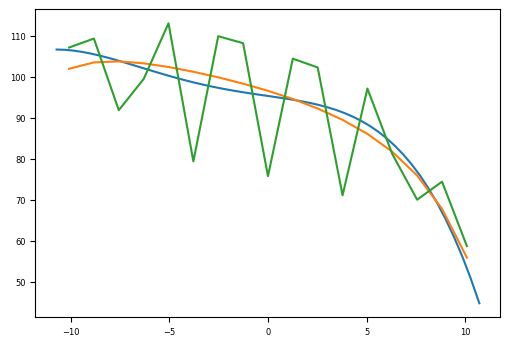

.. code:: ipython3

    # F2 1D Powers
    plt.plot(yvals_nem, power_f2_nem)
    plt.plot(yvals, meshTo1D(arr=power_f2, direction='y'))
    plt.plot(yvals, meshTo1D(arr=serpentPower_f2, direction='y'))

.. parsed-literal::

    [<matplotlib.lines.Line2D at 0x7f219879ff20>]

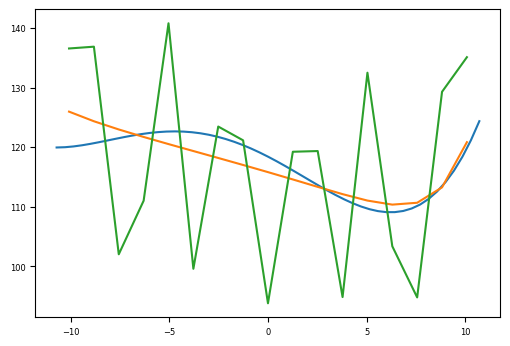

.. code:: ipython3

    # F11 1D Powers
    plt.plot(yvals_nem, power_f11_nem)
    plt.plot(yvals, meshTo1D(arr=power_f11, direction='y'))
    plt.plot(yvals, meshTo1D(arr=serpentPower_f11, direction='y'))
    # plt.plot(yvals, meshTo1D(arr=testing_power, direction='y'))

.. parsed-literal::

    [<matplotlib.lines.Line2D at 0x7f21995a9880>]

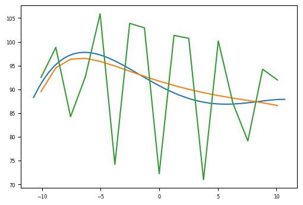

.. code:: ipython3

    # F2-F11 power density for each method
    xvals_nem = np.linspace(-dx, dx, 51*2)
    xvals_serpent = np.linspace(-dx, dx, 34)

    plt.plot(xvals_serpent[0:17], meshTo1D(arr=serpentPower_f2, direction='y'), 'k-', label='Serpent')
    plt.plot(xvals_serpent[17:], meshTo1D(arr=serpentPower_f11, direction='y'), 'k-')

    plt.plot(xvals_serpent[0:17], meshTo1D(arr=power_f2, direction='y'), 'r--', label='AFEN')
    plt.plot(xvals_serpent[17:], meshTo1D(arr=power_f11, direction='y'), 'r--')

    plt.plot(xvals_nem[0:51], power_f2_nem, 'b--', label='NEM')
    plt.plot(xvals_nem[51:], power_f11_nem, 'b--')

    plt.xlabel('X (cm)', fontsize=14)
    plt.ylabel('Power Density (W/cc)', fontsize=14)
    plt.legend(fontsize=14)
    plt.xticks(fontsize=10)
    plt.yticks(fontsize=10)
    plt.grid()

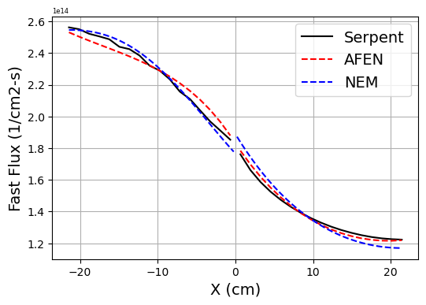

.. code:: ipython3

    # F12-ref fast flux for each method
    xvals_nem = np.linspace(-dx, dx, 51*2)
    xvals_serpent = np.linspace(-dx, dx, 34)

    plt.plot(xvals_serpent[0:17], meshTo1D(arr=fastHetFlux_f12, direction='y'), 'k-', label='Serpent')
    plt.plot(xvals_serpent[17:], meshTo1D(arr=fastHetFlux_ref, direction='y'), 'k-')

    plt.plot(xvals_serpent[0:17], meshTo1D(arr=univ_f12.flux2d[0], direction='y'), 'r--', label='AFEN')
    plt.plot(xvals_serpent[17:], meshTo1D(arr=univ_ref.flux2d[0], direction='y'), 'r--')

    plt.plot(xvals_nem[0:51], flux_f12[0], 'b--', label='NEM')
    plt.plot(xvals_nem[51:], flux_ref[0], 'b--')

    plt.xlabel('X (cm)',fontsize=14)
    plt.ylabel('Fast Flux (1/cm2-s)',fontsize=14)
    plt.legend(fontsize=14)
    plt.xticks(fontsize=10)
    plt.yticks(fontsize=10)
    plt.grid()

.. image:: homework5_files/homework5_63_0.png

.. code:: ipython3

    # F12-ref thermal flux for each method
    xvals_nem = np.linspace(-dx, dx, 51*2)
    xvals_serpent = np.linspace(-dx, dx, 34)

    plt.plot(xvals_serpent[0:17], meshTo1D(arr=thermalHetFlux_f12, direction='y'), 'k-', label='Serpent')
    plt.plot(xvals_serpent[17:], meshTo1D(arr=thermalHetFlux_ref, direction='y'), 'k-')

    plt.plot(xvals_serpent[0:17], meshTo1D(arr=univ_f12.flux2d[1], direction='y'), 'r--', label='AFEN')
    plt.plot(xvals_serpent[17:], meshTo1D(arr=univ_ref.flux2d[1], direction='y'), 'r--')

    plt.plot(xvals_nem[0:51], flux_f12[1], 'b--', label='NEM')
    plt.plot(xvals_nem[51:], flux_ref[1], 'b--')

    plt.xlabel('X (cm)',fontsize=14)
    plt.ylabel('Thermal Flux (1/cm2-s)',fontsize=14)
    plt.legend(fontsize=14)
    plt.xticks(fontsize=10)
    plt.yticks(fontsize=10)
    plt.grid()

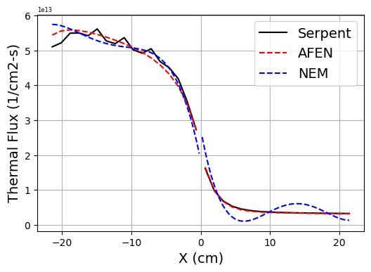

