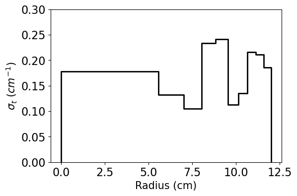
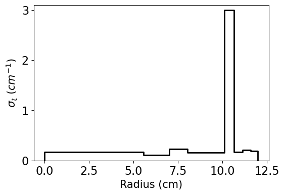
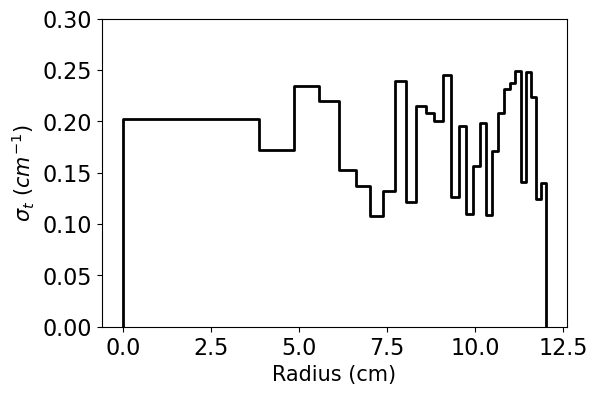
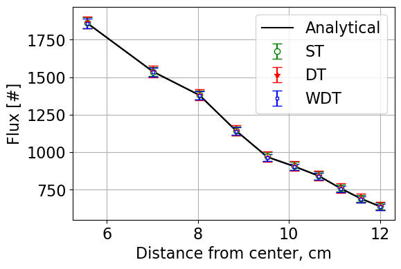
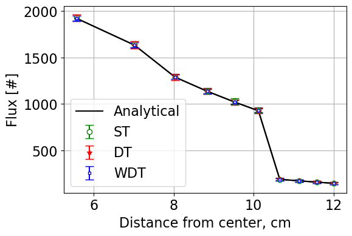
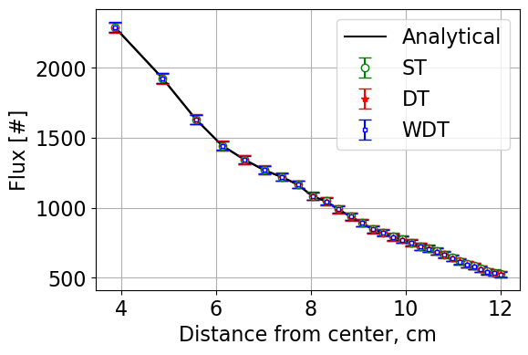

.. _proj1:

Project 1: Neutron Transport With Monte Carlo
---------------------------------------------

======================
Quick Scrolling
======================
* :ref:`Description <_project1_description>`
* :ref:`Methodology <project1_methods>`
* :ref:`Results <project1_results>`
* :ref:`Summary <project1_summary>`
* :ref:`Jupyter Notebook <project1_jupyter>`
* :ref:`Methods and Classes <project1_classes>`

.. _project1_description:

===========
Description
===========

This project involves the implementation of a Weighted Delta Tracking (WDT) methodology for a simple spherical point source.
WDT is a standard methodology within Monte Carlo codes to track particles. In certain situations,
WDT can result in significant speedup compared to the standard Surface Tracking (ST) methodology - especially
for problems with complex geometry (e.g. TRISO particles) or many surfaces.

This project makes reference to the following sources used in the development of the Serpent 2 Monte Carlo code:

1. J. Leppanen, 2010. "Performance of Woodcock delta-tracking in lattice physics applications using the Serpent Monte Carlo reactor physics burnup calculation code," Annals of Nuclear Energy, 37, 715-722.
2. L.W.G. Morgan, D. Kotlyar, 2015. "Weighted-delta-tracking for Monte Carlo particle transport," Annals of Nuclear Energy, 85, 1184-1188.

.. _project1_methods:

===========
Methodology
===========

Weighted Delta Tracking
^^^^^^^^^^^^^^^^^^^^^^^

WDT starts the same as the standard Delta Tracking (DT) methodology.
After a particles initial position (:math:`\pmb{r_0}`) and direction (:math:`\pmb{\Omega}`) are sampled, a collision location is computed as:

		.. math::

			d = -\frac{ln(\xi)}{\Sigma_{maj}}

			\pmb{r} = \pmb{r_0} + d \pmb{\Omega}

where,
		:math:`\xi` is a random number between 0 and 1,

		:math:`\Sigma_{maj}` is the majorant cross section (taken as the largest cross section in the problem).

If the neutron does not leak (:math:`\pmb{r}` still lies within the problem boundaries), Delta Tracking normally then performs a rejection/acceptance technique by rolling a random number to determine whether to accept this collision.
Instead of rejecting potential collisions, WTD instead accepts every collision and adjusts the particle weight according to the ratio between the total
and majorant cross section. The total cross section is taken at :math:`\pmb{r}` while the majorant cross section is the maximum cross section in the problem.

Since the particle is assumed to collide, we first compute and update the score as:

		.. math::

			S_i = \frac{\Sigma_t}{\Sigma_{maj}} w_{n-1}

where,
		:math:`w_{n-1}` is the most recent weight of the particle.

After scoring, we then adjust the particle weight to preserve a fair game for the "daughter" particle that leaves the collision.

		.. math::

			w_{n} = w_{n-1}(1-\frac{\Sigma_t}{\Sigma_{maj}})

The particle then continues and the process repeats until it leaks or is killed by :ref:`Russian Roulette <RR>` .

.. _RR:

Russian Roulette
^^^^^^^^^^^^^^^^^^^^^^^
To avoid particles with extremely low weights (and thus avoid tracking particles with little contribution to the overall problem), Russian Roulette can be "played"
after a particles weight is updated coming out of a collision. First a threshold weight, :math:`w_{th} \approx 0.25` is chosen to define a cutoff
at which the Russian Roulette subroutine is run. Then, a random number, :math:`\eta`, is rolled. If :math:`\eta` is found to be less than the current
particles weight, the particle survives and is set to its starting weight (usually 1.0). Otherwise, the particle is killed completely. The whole routine
can be performed in the following code snippet:

.. code::

	if this_neutron.weight < (0.25 / starting_weight):
		# Roll for whether it survives.
		eta = np.random.rand()
		if eta < this_neutron.weight:
			# We have survived russian roulette (phew!)
			this_neutron._setWeight(weight=starting_weight)
		else:
			# Particle is kill
			break

.. _project1_results:

===========
Results
===========

To compare the three available methdologies and validate the implementation of the WDT methdology, three problems were ran:

1. A 12.0 cm, 10 region sphere with cross sections randomized between 0.10 and 0.25 cm :math:`^{-1}`
2. The same as Case 1 but with Region 7 having a cross section of 3 cm :math:`^{-1}`
3. The same as Case 1 but with 30 instead of 10 regions.

Comparisons of the neutron flux represent the accuracy/correctness of each implementation. The Figure of Merit (FoM) is as follows:

		.. math::

			FoM = \frac{1}{\sigma^2 t}

where,
	:math:`t` is the time in seconds,

	:math:`\sigma^2` is the average variance across all tallies.

The cross sections, flux distributions, and summary tables for each problem are shown below. Dicussion of results appears afterwards.

Case 1 total XS:

Case 2 total XS:

Case 3 total XS:

Case 1 fluxes:

Case 2 fluxes:

Case 3 fluxes:

.. csv-table:: Case 1 Summary Table
   :file: project1_csv/case1.csv
   :widths: 50,50,50,50,50
   :header-rows: 1

.. csv-table:: Case 2 Summary Table
   :file: project1_csv/case2.csv
   :widths: 50,50,50,50,50
   :header-rows: 1

.. csv-table:: Case 3 Summary Table
   :file: project1_csv/case3.csv
   :widths: 50,50,50,50,50
   :header-rows: 1

Based on results from all three cases, it is clear that the implementation of the weighted delta tracking method is correct in implementation as
the results are within statistics of the true analytical solution.

Additionally, for the case representing a reasonable Monte Carlo problem (Case 1), WDT appears to be the "best" method as the FoM is found to be the highest meaning
it is the most efficient method from a computational standpoint.

However, the performance of both Delta Tracking methods degrade significantly in Case 2 - the Surface Tracking method is found to be much more
computationally efficient. This is primarily due to the majorant cross section being very large for the problem of interest.

Finally, Case 3 resembles a problem where Surface Tracking is known to perform very poorly due to the large number of surfaces that a particle must cross
before an interaction. The FoM for both the Delta Tracking methods is found to be higher than the FoM for the Surface Tracking methods in Case 3.

.. _project1_summary:

=================================
Summary
=================================

A Weighted Delta Tracking method was implemented for a simple spherical point source problem and the method's efficiency was compared to existing Delta Tracking and
Surface Tracking methods. Each method was compared across three problems - one with reasonable cross sections, one with a very large cross section
in a single region, and another with many regions (and thus surfaces).

The Weighted Delta Tracking method was found to perform the best out of all three methods - except
in the case of a very large cross section at which it was found to be comparable, but slightly slower, to standard Delta Tracking.

.. _project1_jupyter:

Jupyter Notebook
---------------------------------------------
A Jupyter Notebook showing the work done is provided :ref:`HERE <proj1_jupyter_notebook>`.

.. _project1_classes:

Classes and Objects
---------------------------------------------

Classes and methods developed in this work:
   * Project 1 Module: :class:`pointsource_sphere`
   * Neutron Class: :class:`pointsource_sphere.WeightedNeutron`
   * Weighted Delta Tracking: :class:`pointsource_sphere.PointSourceInSphere._SolveWDT`
   * FOM Calculator: :class:`pointsource_sphere.PointSourceInSphere.PrintFOM`
