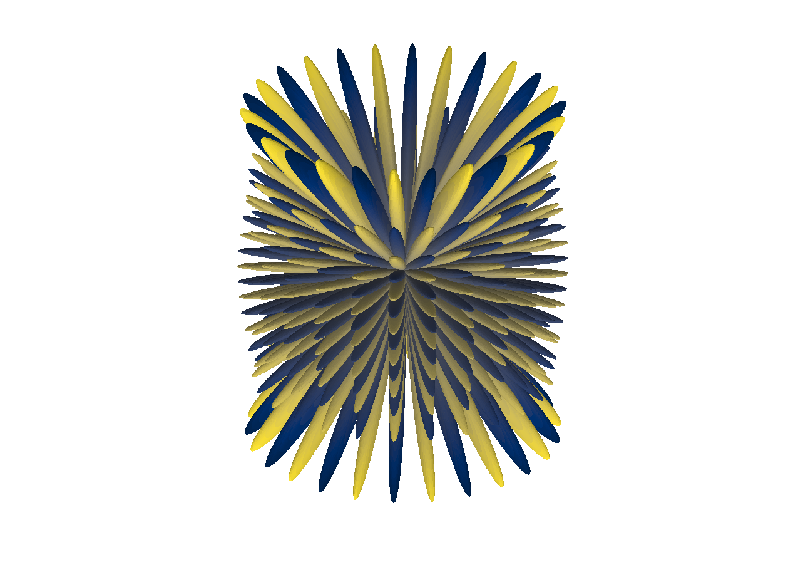
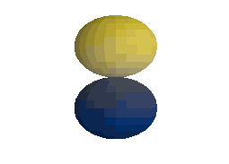
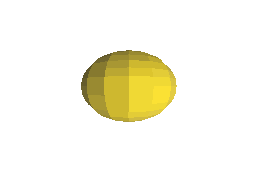
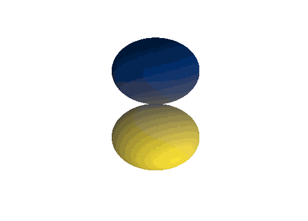
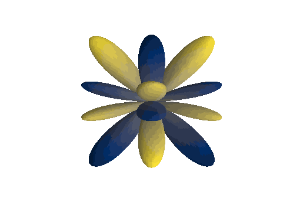
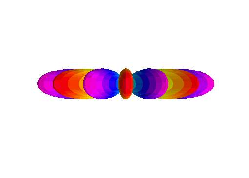

.. _proj2_sph_harm:

Project 2: Spherical Harmonics
---------------------------------------------

======================
Quick Scrolling
======================
* :ref:`Description <proj2_sph_harm_desc>`
* :ref:`Methodology <proj2_sph_harm_methods>`
* :ref:`Results <proj2_sph_harm_results>`
* :ref:`Jupyter Notebook <proj2_sph_harm_jupyter>`
* :ref:`Methods and Classes <proj2_sph_harm_classes>`

.. _proj2_sph_harm_desc:

===========
Description
===========

A few functions are made for plotting/visualizing spherical harmonics.

.. _proj2_sph_harm_methods:

===========
Methodology
===========

We use :class:`sph_harmonics.BibicallyAccurateSphericalHarmonics` to plot 3D spherical harmonics.

The convenience function :class:`sph_harmonics.imageCropper` is included to crop off excess fat from the images
generated by matplotlib.

An example is below for l=26, m=13

.. code::

	# Lets make a nice plot of our favorite spherical harmonic function.
	l=26
	m=13
	elev = 25
	azimRot = 45
	nangles = 600
	dpi=250

	# Plot and save
	BibicallyAccurateSphericalHarmonics(l=l, m=m, sphType='real', nangles=nangles, elev=elev, azimRot=azimRot, dpi=dpi, filename='L26_m13.png', doPlot=True)

	# Crop image for convenience.
	imageCropper(filename='L26_m13.png', outname='L26_m13.png', left_inches=0.5, right_inches=0.4, top_inches=1.2, bottom_inches=1.15, dpi=dpi)

We can also make a number of images and turn them into a gif using :class:`sph_harmonics.gifMaker`. Simply gather an ordererd list of filenames you want to turn
into a gif and then run gifMaker()

An example is provided below. In this case we take many snapshots of different angular rotations to envision the function rotating in space!

.. code::

	# Lets make a gif (do not run high dpi or high nangles unless you value your time)
	from IPython.display import Image

	l=1
	m=0
	nangles = 25
	dpi=50
	nFrames = 200

	# vary the angles
	elev_angles = np.linspace(0, 2*np.pi, nFrames) * 360 / 2.0 / np.pi # 1 full 360 degree rotation
	azim_angles = np.linspace(0, 2*np.pi, nFrames) * 360 / 2.0 / np.pi # 1 full 360 degree rotation

	filename_list = []
	for i, _ in enumerate(elev_angles):
		# Make filename
		# !!! make sure the folder L1_M0_GIF exists before running !!!
		filename = './L1_M0_GIF/'+str(i)+'.png'

		# Generate a snapshot and save it
		BibicallyAccurateSphericalHarmonics(l=l, m=m, sphType='real',
				nangles=nangles, elev=elev_angles[i], azimRot=azim_angles[i],
				dpi=dpi, filename=filename,
				doPlot=False)
		# Crop some fat off the image
		imageCropper(filename=filename, outname=filename, left_inches=0.5, right_inches=0.4, top_inches=1.2, bottom_inches=1.15, dpi=dpi)

		# Append filename
		filename_list.append(filename)

	# Make a cute little gif of our function rotating :)
	gifMaker(output_filename='./L1_M0_GIF/L1_M0.gif', duration=5, filenames=filename_list)

	# Display gif:
	Image(url='./L1_M0_GIF/L1_M0.gif')

.. _proj2_sph_harm_results:

===========
Results
===========

Some fun spherical harmonics from Question 1 are plotted here:

:math:`Y_1^1(\theta, \varphi)`:

:math:`Y_1^0(\theta, \varphi)`:

:math:`Y_1^{-1}(\theta, \varphi)`:

And some even more fun ones ...

:math:`Y_2^1(\theta, \varphi)`:

:math:`Y_6^3(\theta, \varphi)`:

:math:`Y_7^7(\theta, \varphi)`:

:math:`Y_{10}^2(\theta, \varphi)`:

.. image:: ../fancy_images/L10_M2.gif
	:align: center
	:width: 250

:math:`Y_{10}^6(\theta, \varphi)`:

.. image:: ../fancy_images/L10_M6.gif
	:align: center
	:width: 250

.. _proj2_sph_harm_jupyter:

Jupyter Notebook
---------------------------------------------
  * A Jupyter notebook is given for the Spherical Harmonics work :ref:`HERE <proj2_sph_harm_notebook>`

.. _proj2_sph_harm_classes:

Classes
---------------------------------------------
Classes and methods developed in this work:
	* Plotter for the spherical harmonic shapes: :class:`sph_harmonics.BibicallyAccurateSphericalHarmonics`
	* Gif maker: :class:`sph_harmonics.gifMaker`
	* Image cropper: :class:`sph_harmonics.imageCropper`
	* Spherical harmonic animator from Dr. Kotlyar: :class:`sph_harmonics.animateSphHarm`
	* Function for getting spherical harmonics from Dr. Kotlyar: :class:`sph_harmonics.getSphHarm`
	* Function for plotting spherical harmonics on a unit sphere from Dr. Kotlyar: :class:`sph_harmonics.plotSphHarm`
