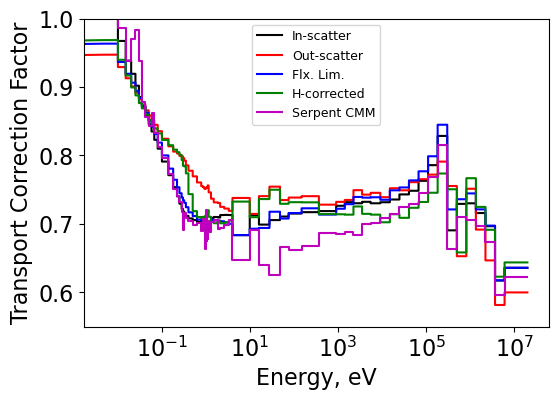

.. _proj3:

Diffusion Coefficients and Critical Spectrum
---------------------------------------------

======================
Quick Scrolling
======================
* :ref:`Description <proj3_description>`
* :ref:`Methodology <proj3_methods>`
* :ref:`Results <proj3_results>`
* :ref:`Summary <proj3_summary>`
* :ref:`Jupyter Notebook <proj3_jupyter>`
* :ref:`Methods and Classes <proj3_classes>`

======================
Description
======================

.. _proj3_description:

This project involves the calculation of diffusion coefficients through a variety of methods. The out-scattering, in-scattering, flux-limited, and Hydrogen-corrected methods are covered.
Additionally, the :math:`B_1`, :math:`P_1`, and CM methods for computing the critical spectrum (and then a diffusion coefficient) are discussed.

.. _proj3_methods:

======================
Methods
======================

-------------
In-Scatter
-------------

The in-scatter method comes from the P1 equations and computes the diffusion coefficient as:

		.. math::
			D_g = \frac{1}{3} \left( \Sigma_{t,g} - \frac{\sum_{g'} \Sigma_{s1,g'g} J_{g'}  }{J_g} \right)^{-1}

The current is generally not known however.
The implementation in this code is to compute the current using a fictitious buckling term to represent the flux gradient and solve the following P1 equation:

		.. math::
			\frac{1}{3} \frac{d\phi_g}{dx} + \Sigma_{t,g}J_g = \sum_{g'} \Sigma_{s1,g'g} J_{g'}

		.. math::
			\frac{1}{3} (B^2)^{0.5} + \Sigma_{t,g}J_g = \sum_{g'} \Sigma_{s1,g'g} J_{g'}

		.. math::
			\left( \underline{\underline{\Sigma_{s1,g'g}}} - \underline{\underline{\Sigma_{t,g}}} \right)\underline{J} = \frac{(B^2)^{0.5}}{3}[1 ... 1]^T

-------------
Out-Scatter
-------------
The out-scatter approach is much simpler. It can be written as:

		.. math::
			\Sigma_{tr,g} \approx \Sigma_{t,g} - \sum_{g'}\Sigma_{s1,g'g}

		.. math::
			D_g = \frac{1}{3\Sigma_{tr,g}}

-------------
Flux-Limited
-------------
The flux-limited approach is similar to the in-scatter approach except the neutron current, which is usually unknown, is replaced by the neutron flux.
The idea is to replace the neutron current by the known neutron flux spectra.

		.. math::
			\Sigma_{tr,g} \approx \Sigma_{t,g} - \frac{\sum_{g'}\Sigma_{s1,g'g} \phi_{g'}}{\phi_g}

		.. math::
			D_g = \frac{1}{3\Sigma_{tr,g}}

-------------------
Hydrogen-Corrected
-------------------
The Hydrogen-corrected approach considers most of the anisotropy to belong to the moderator (which is generally true for LWR's).
Two calculations are normally run - a medium of pure moderating material (pure Hydrogen) and a typical fuel assembly (FA).

The approach subtracts the "bad" out-scattering based component of the homogenized out-scattering transport xs and then adds a "good" in-scatter based xs.

First, the transport correction ratio, :math:`\tau_H` for pure Hydrogen is obtained using a method (potentially the in-scatter approach) suitable for accurate calculations of transport cross sections
or transport correction factors.

Then, the pure Hydrogen microscopic cross section can be computed from the out-scatter transport xs and the Hydrogen number density in the pure Hydrogen medium (:math:`\sigma_{tr,out}^H = \Sigma_{tr,out}^H / N_{inf}^{H}`)

Using the number density of Hydrogen in the homogenized fuel assembly, :math:`N_{FA}^{H}`, one can then compute the macroscopic transport xs without Hydrogen:

		.. math::
			\Sigma_{tr,out}^{FA-H} = \Sigma_{tr,out}^{FA} -  \sigma_{tr,out}^H N_{FA}^{H}

Then, the "corrected" Hydrogen transport xs can be added using the transport correction factor:

		.. math::
			\Sigma_{tr,corrected}^{FA} = \Sigma_{tr,out}^{FA-H} + \sigma_{t}^H N_{FA}^{H} \tau_H

Essentially, the "bad" out-scattering component from the anisotropic Hydrogen is removed and the "good" in-scattering based transport xs is added.

--------------------------------------
:math:`B_1` Critical Spectrum
--------------------------------------

The :math:`B_1` method is much too lengthy to discuss here. However, its implementation is within :class:`diffusion_coeffs.CriticalSpectrum` and :class:`diffusion_coeffs.SolveB1`.

--------------------------------------
:math:`P_1` Critical Spectrum
--------------------------------------

The :math:`P_1` method is also too lengthy to discuss here. However, its implementation is within :class:`diffusion_coeffs.CriticalSpectrum` and :class:`diffusion_coeffs.SolveB1`. The only difference
from the :math:`B_1` method
is that the :math:`\alpha` terms are replaced by all ones in the :math:`P_1` approach.

--------------------------------------
CM Critical Spectrum
--------------------------------------
The CM critical spectrum approach is that used in CASMO-4E. Essentially, the following fundamental mode equation is solved using "known" fine group transport cross sections:

		.. math::
			\Sigma_{tr,g}\phi_g + D_g B^2 \phi_g = \chi_g + \sum_{g'}\Sigma_{s0,g'g}\phi_{g'}

An iterative methodology similar to the :math:`B_1` approach is implemented in which the value of :math:`B^2` is iterated on until balance between the left and right sides of the following is achieved:

		.. math::
			( \underline{\underline{\Sigma_t}} + B^2\underline{\underline{D}} -\underline{\underline{\Sigma_{s0,g'g}}})\underline{\phi} = \underline{\chi}

		.. math::
			k = \sum_{g} (\nu \Sigma)_{f,g}\phi_g

The value of :math:`k` is changed as in the :math:`B_1` approach.

======================
Results
======================

.. _proj3_results:

--------------------------------------
Transport correction factor results
--------------------------------------

The transport correction ratio was computed for all four methods of computing the diffusion coefficient and is shown below for the fuel assembly case. The CMM solution from Serpent is also shown for comparison.

It is clear that the various methods all produce different transport correction factors - especially in the thermal and epithermal ranges.
Most methods produce reasonable results in the thermal range - except for the out-scattering method.

--------------------------------------
Critical spectrum results
--------------------------------------

The three buckling methods were compared. :math:`B^2` values are shown below.

+--------+------------+
| Method | B2 values  |
+========+============+
| CM     | 0.0002459  |
+--------+------------+
| B1     | 0.0002549  |
+--------+------------+
| P1     | 0.0002542  |
+--------+------------+

Fluxes from each are also plotted below. It is important to note that the flux needed extremely little correction due to the fact that the original problem was already very close to critical.

.. image:: project3_images/hw3_17_1.png
	:align: center
	:width: 400

--------------------------------------
Diffusion coefficient results
--------------------------------------

2g diffusion coefficients were computed using each of the methods discussed above.
These are shown below and compared to the Serpent CMM diffusion coefficients in terms of percent difference.
Diffusion coefficients are condensed directly from the fine group diffusion coefficients and fine group fluxes from Serpent.
In the case of the :math:`B_1` and :math:`P_1` approaches, fine group diffusion coefficients are computed using the currents from :math:`B_1` and :math:`P_1` theory and then condensed.

+---------------------------------------+----------------------+-------------------------+--------------+-----------------+
| Method                                | Fast XS (> 0.625 eV) | Thermal XS (< 0.625 eV) | Fast % Diff. | Thermal % Diff. |
+=======================================+======================+=========================+==============+=================+
| Serpent CMM (Diffusion Coeff.)        | 1.758                | 0.8807                  |              |                 |
+---------------------------------------+----------------------+-------------------------+--------------+-----------------+
| In-scatter (Diffusion Coeff.)         | 1.699                | 0.8830                  | -3.385       | 0.265           |
+---------------------------------------+----------------------+-------------------------+--------------+-----------------+
| Out-scatter (Diffusion Coeff.)        | 1.734                | 0.8263                  | -1.382       | -6.178          |
+---------------------------------------+----------------------+-------------------------+--------------+-----------------+
| Flux-limited (Diffusion Coeff.)       | 1.682                | 0.8719                  | -4.322       | -0.995          |
+---------------------------------------+----------------------+-------------------------+--------------+-----------------+
| Hydrogen-corrected (Diffusion Coeff.) | 1.723                | 0.8400                  | -1.994       | -4.621          |
+---------------------------------------+----------------------+-------------------------+--------------+-----------------+
| CM (Diffusion Coeff.)                 | 1.763                | 0.8845                  | 0.283        | 0.428           |
+---------------------------------------+----------------------+-------------------------+--------------+-----------------+
| B1 (Diffusion Coeff.)                 | 1.699                | 0.8829                  | -3.356       | 0.254           |
+---------------------------------------+----------------------+-------------------------+--------------+-----------------+
| P1 (Diffusion Coeff.)                 | 1.703                | 0.8833                  | -3.127       | 0.296           |
+---------------------------------------+----------------------+-------------------------+--------------+-----------------+
| Serpent B1 (Reduced Abs.)             | 7.7596E-03           | 6.7626E-02              |              |                 |
+---------------------------------------+----------------------+-------------------------+--------------+-----------------+
| CM (Reduced Abs.)                     | 7.7612E-03           | 6.7643E-02              | 0.020        | 0.026           |
+---------------------------------------+----------------------+-------------------------+--------------+-----------------+
| B1 (Reduced Abs.)                     | 7.7618E-03           | 6.7643E-02              | 0.028        | 0.025           |
+---------------------------------------+----------------------+-------------------------+--------------+-----------------+
| P1 (Reduced Abs.)                     | 7.7619E-03           | 6.7643E-02              | 0.030        | 0.026           |
+---------------------------------------+----------------------+-------------------------+--------------+-----------------+

.. _proj3_summary:

======================
Summary
======================

Various methods for obtaining diffusion coefficients were discussed and compared. In-scatter, out-scatter, flux-limited, and Hydrogen-corrected approaches were considered for
computing the transport correction ratios and coarse-group diffusion coefficients from a fine group dataset.

Critical spectrum calculations were also performed - :math:`B_1`, :math:`P_1` and CM approaches were all implemented and compared. Also, the diffusion coefficients computed from each were compared to
the prior four methods.

.. _proj3_jupyter:

======================
Jupyter
======================

* A Jupyter notebook is given for the calculations performed :ref:`HERE <proj3_notebook>`

.. _proj3_classes:

======================
Methods and Classes
======================
  * In-scattering transport xs method developed in class: :class:`diffusion_coeffs.InScatter`
  * Out-scattering transport xs method developed in class: :class:`diffusion_coeffs.OutScatter`
  * Flux-limited transport xs method developed in class: :class:`diffusion_coeffs.FluxLimited`
  * 2g xs condensation function: :class:`diffusion_coeffs.Condense2gr`
  * B1 equation solver: :class:`diffusion_coeffs.SolveB1`
  * Critical spectrum calculator for :math:`B_1` and :math:`P_1` methods: :class:`diffusion_coeffs.CriticalSpectrum`
  * CM critical spectrum method: :class:`diffusion_coeffs.CMSpectrum`
