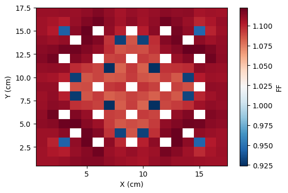
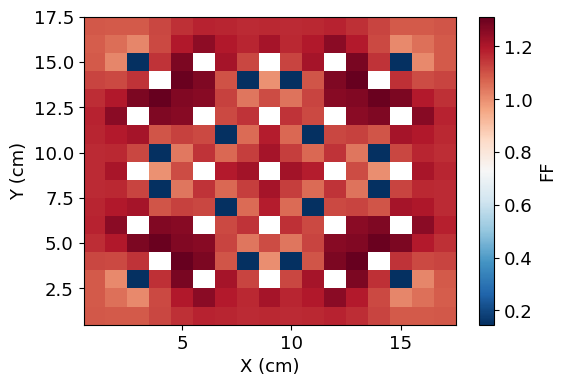
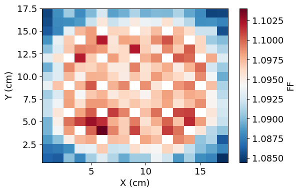
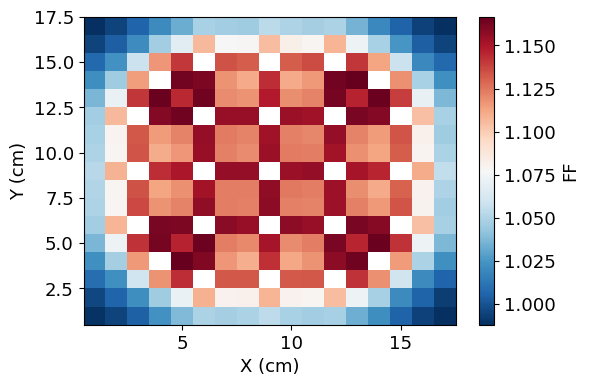
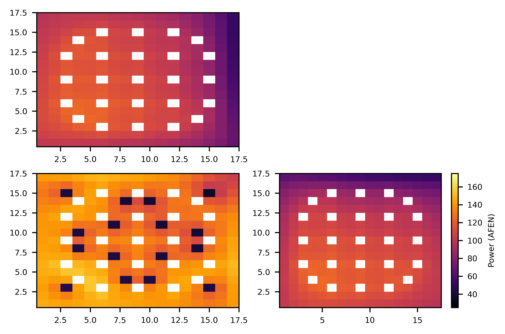
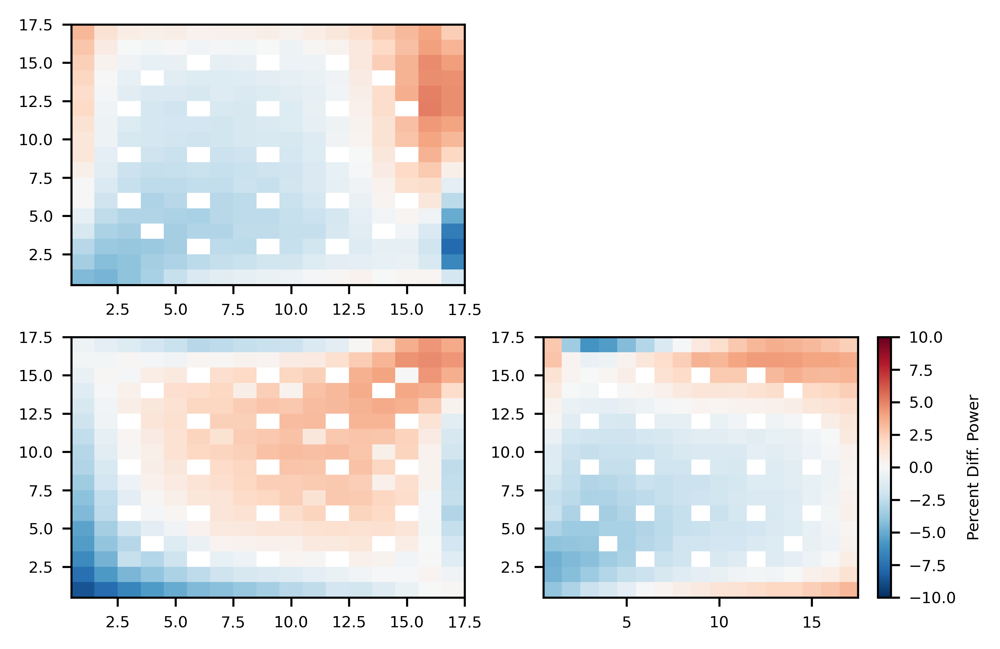
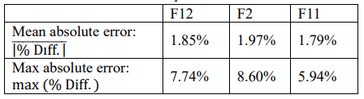

.. _proj6:

Project 6: Two-Step approach
---------------------------------------------

======================
Quick Scrolling
======================
* :ref:`Description <_project6_description>`
* :ref:`Methodology <project6_methods>`
* :ref:`Results <project6_results>`
* :ref:`Summary <project6_summary>`
* :ref:`Jupyter Notebook <project6_jupyter>`
* :ref:`Methods and Classes <project6_classes>`

.. _project6_description:

===========
Description
===========

This project details the application of the standard two-step approach for LWR analysis.
First, power form factors,  corner discontinuity factors, and group constants are generated from standalone Serpent calculations for single assemblies.
Then, the previously developed NEM solver is used to obtain surface fluxes for a colorset.
Surface fluxes along with corner fluxes and corner discontinuity factors are then used in the previously developed AFEN solver to calculate the
2D power profile in the colorset.
Comparisons are made to the true heterogenous power profile predicted by Serpent.

.. _project6_methods:

===========
Methodology
===========

The standard two step approach begins by collecting group constants for a single assembly type. This is done via Serpent calcuations for a 4.55% enriched assembly and a
2.60% enriched assembly in standalone assembly calculations. A full colorset calculation is also done to obtain reflector group constants and a reference solution to the full
colorset.

The following 2D colorset is used in all calculations:

.. image:: homework4_files/homework4_4_0.png
	:align: center
	:width: 500

Form factors for each assembly are computed as follows:

		.. math::

			f_g(x,y) = \frac{\kappa \Sigma_{f,g}\phi^{het}_g(x,y)}{\bar{\kappa \Sigma_{f,g}} \phi^{inf}}

Next, the NEM solver is used to obtain homogenous surface fluxes over each boundary of each node in the colorset.

Using surface fluxes with corner discontinuity factors computed from Serpent, homogenized corner-point fluxes can be computed as:

		.. math::

			\bar{\phi}_{c,g}(j) = \frac{1}{N} \left[\sum_{k=1}^{N} \frac{\phi_{c,g}(k)f_{c,g}(k) }{f_{c,g}(j)} \right]

where j is the node of interest, c is the corner of interest, :math:`f_{c,g}` is the corner discontinuity factor, and :math:`\phi_{c,g}` is the corner flux.

The corner flux used in the previous equation can be estimated from the following:

		.. math::

			\phi_{c,g}(j) = \phi_{g,s1} + \phi_{g,s2} - \bar{\phi}(j)

where :math:`\phi_{g,s1}` and :math:`\phi_{g,s2}` are the side fluxes for that node and corner.

With homogenous corner point fluxes and surface fluxes obtained, the previously developed AFEN method can be used and the 2D flux can be obtained.

With the 2D flux obtained, the power can be estimated using the form factors:

		.. math::

			P''' = \sum_g ff_g(x,y)\phi_g(x,y)\bar{\kappa \Sigma_{f,g}}

.. _project6_results:

===========
Results
===========

.. _project6_summary:

Since the NEM and AFEN methods have been previously explained in :ref:`Project 4 <proj4>` and :ref:`Project 5 <proj5>`, results are mainly presented for the
newly computed form factors and power distributions computed by AFEN with form factors.

The form factors generated during the group constant generation stage are shown below:

4.55% enriched assembly (fast form factors)

4.55% enriched assembly (thermal form factors)

2.60% enriched assembly (fast form factors)

2.60% enriched assembly (thermal form factors)

Using the form factors and the previously outlined methodology, the following power profiles have been obtained.

Serpent reference power distributions:

AFEN with form factors power distributions:

Percent difference between Serpent and AFEN:

The absolute mean and max errors are shown below for each assembly:

Overall, the results are very good as the mean absolute error is less than 2% for each assembly.

=================================
Summary
=================================

The two step method for a 2x2 colorset has been carried out by starting with homogenous assembly calculations. The NEM has been used for
obtaining surface flux values which are then used in a 2D AFEN solution to obtain form-factor adjusted power profiles for each fuel pin. Agreement
between the AFEN solution and the reference Serpent solution is reasonably good considering the speed and relative simplicity of the calculations performed.

.. _project6_jupyter:

Jupyter Notebook
---------------------------------------------

* A Jupyter notebook is given for the calculations performed :ref:`HERE <project6_notebook>`

.. _project6_classes:

Classes and Objects
---------------------------------------------
Classes and objects used have been previously outlined in the :class:`analytic_nodal_expansion` and :class:`nem` modules.
